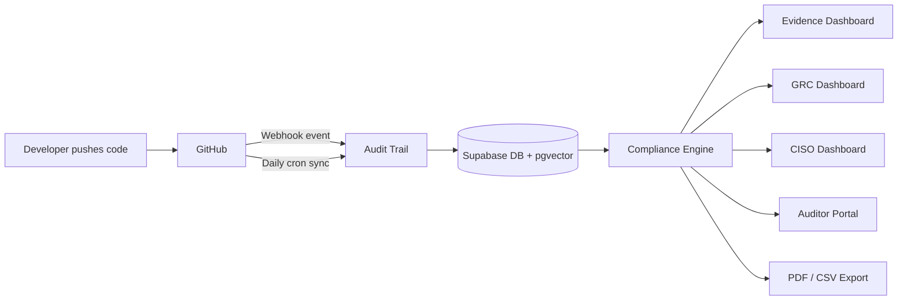

# Audit Trail

> Compliance that works in the background. Surfaces when it counts.

Audit Trail is compliance infrastructure, not compliance overhead. Connect your GitHub repositories once via a GitHub App and Audit Trail silently maps every commit, pull request, code review, branch protection rule, Dependabot alert, code scanning finding, secret scanning alert, and deployment approval to the controls inside twelve major compliance frameworks - continuously, in real time, invisibly. Daily GRC operations, CISO reporting, and due diligence packages are already there when you need them.

---

## Table of Contents

- [How It Works](#how-it-works)
- [GitHub Integration](#github-integration)
- [Evidence Collection](#evidence-collection)
- [Compliance Frameworks](#compliance-frameworks)
- [AI Governance](#ai-governance)
- [Vector Embeddings](#vector-embeddings)
- [GRC Operations](#grc-operations)
- [CISO Dashboard](#ciso-dashboard)
- [Auditor Portal](#auditor-portal)
- [Reports and Exports](#reports-and-exports)
- [Scheduled Reports](#scheduled-reports)
- [Observability and Security](#observability-and-security)
- [Architecture](#architecture)
- [Environment Variables](#environment-variables)
- [Local Development](#local-development)
- [Deployment](#deployment)
- [Testing](#testing)
- [Project Structure](#project-structure)

---

## How It Works



1. **Install the GitHub App** - one click, read-only access across selected repos. Webhooks activate immediately.
2. **Events stream in real time** - every push, PR, review, security alert, and deployment is captured the moment it happens.
3. **Compliance engine maps evidence** - pattern matching combined with Gemini vector embeddings maps each artifact to specific controls across twelve frameworks.
4. **Gaps are flagged instantly** - security alerts, unreviewed merges, and weakened branch protection trigger compliance alerts before your auditor sees them.
5. **GRC and CISO views stay current** - risk register, gap ownership, posture trend, and business impact figures update with every sync.
6. **Export when ready** - PDF reports, CSV tables, and auditor packages with timestamped evidence, control mappings, and source references.

---

## GitHub Integration

### App installation

1. User clicks **Install GitHub App** on the dashboard
2. GitHub redirects to `github.com/apps/audit-trail-app/installations/new`
3. User selects which repositories to grant access to
4. GitHub redirects back to `/api/github/app-callback?installation_id=xxx`
5. The installation ID is stored on the `github_connections` row
6. Webhooks start flowing immediately for all selected repos

### Webhook security

Every incoming webhook is verified with HMAC-SHA256 before any processing:

```typescript
const expected = `sha256=${createHmac("sha256", secret).update(body).digest("hex")}`;
timingSafeEqual(Buffer.from(expected), Buffer.from(signature));
```

Delivery IDs from `x-github-delivery` are stored for deduplication - replayed webhooks are silently ignored. The endpoint returns `{ received: true }` immediately; processing is fire-and-forget with error logging.

### Webhook events processed

| Event                     | Handler                                         | Evidence produced                                       |
| ------------------------- | ----------------------------------------------- | ------------------------------------------------------- |
| `push`                    | `handlePushEvent`                               | Commits mapped to change management, secure development |
| `pull_request`            | `handlePullRequestEvent`                        | PRs mapped to change management, peer review            |
| `pull_request_review`     | `handlePullRequestReviewEvent`                  | Code review evidence                                    |
| `member` / `organization` | `handleMemberEvent` / `handleOrganizationEvent` | Access control evidence                                 |
| `workflow_run`            | `handleWorkflowRunEvent`                        | CI artifact processing (SARIF, SBOM, test reports)      |
| `dependabot_alert`        | `handleDependabotAlertEvent`                    | Critical/high CVEs trigger ComplianceAlert              |
| `code_scanning_alert`     | `handleCodeScanningAlertEvent`                  | SAST findings trigger ComplianceAlert                   |
| `secret_scanning_alert`   | `handleSecretScanningAlertEvent`                | Credential exposure triggers CRITICAL alert             |

### Org resolution

The webhook handler resolves which org an event belongs to by checking (in order):

1. `repository.full_name` matched against the `repositories` table
2. `organization.login` matched against `github_connections`
3. `installation.id` matched against `github_connections.installation_id`

If no org is found, returns `200 { received: true, processed: false }` to prevent GitHub retrying.

---

## Evidence Collection

Evidence is collected from four source types and enriched with supplementary signals.

### Commits

Commit messages are analysed against five pattern families:

- `DEPENDENCY_PATTERNS` - dependency updates, CVE patches, Dependabot/Renovate references
- `INFRASTRUCTURE_PATTERNS` - Docker, Terraform, Kubernetes, Helm, CI config changes
- `SECURITY_PATTERNS` - auth, encryption, XSS/SQLi/CSRF fixes, sanitization
- `TEST_PATTERNS` - unit, integration, e2e test additions
- `CICD_SECURITY_PATTERNS` - Snyk, SonarQube, CodeQL, SAST/DAST tool references

Commit signing (`git commit -S`) is tracked separately: verified commits map to developer authentication controls (A.5.17, E8-MFA) at `high` relevance.

### Pull requests

State (merged/open/closed), review count, base branch, author, merge timestamp.

### Branch protection

Required reviews, CODEOWNERS enforcement, dismiss-stale-reviews, require-status-checks, admin-bypass setting, protection strength scoring.

### Security alerts

Dependabot CVE severity, code scanning rule severity and tool name, secret scanning secret type.

### CI artifacts

Workflow run artifacts are classified by name pattern (SARIF, SBOM, test reports, coverage) and summarised - vulnerability counts, test pass/fail, coverage percentage. Raw artifact content is never stored.

### Deployment environments

GitHub environment protection rules are synced: required reviewers, prevent-self-review, and required branch policies provide change management and segregation-of-duties evidence.

### Evidence scoring

| Status         | Score | Condition                           |
| -------------- | ----- | ----------------------------------- |
| `has_evidence` | 3     | Strong, direct evidence present     |
| `partial`      | 2     | Some evidence, below threshold      |
| `limited`      | 1     | Exists but insufficient for control |
| `no_evidence`  | 0     | Nothing found                       |

Overall framework score = sum of control scores / max possible score x 100.

### Confidence scoring

Evidence mapping blends two signals:

- Pattern-match score: 40% weight
- Gemini embedding cosine similarity: 60% weight

| Tier                | Similarity  | Meaning                      |
| ------------------- | ----------- | ---------------------------- |
| `high`              | >= 0.85     | Strong semantic match        |
| `medium`            | 0.60 - 0.84 | Probable match               |
| `low`               | < 0.60      | Weak signal, flag for review |
| `auditor_confirmed` | -           | Manually verified by auditor |

---

## Compliance Frameworks

Twelve frameworks are supported out of the box. Free plans include 3 frameworks; Pro unlocks all twelve.

| Framework            | Controls | Evidence types                                                |
| -------------------- | -------- | ------------------------------------------------------------- |
| ISO 27001:2022       | 10       | Commits, PRs, reviews, branch protection, alerts              |
| Essential Eight      | 5        | Patching, MFA, application control, CI                        |
| NIST CSF 2.0         | 7        | Configuration management, software dev, monitoring            |
| NIST SP 800-53 Rev 5 | 7        | Account management, change control, flaw remediation          |
| SOC 2                | 5        | Access control, change management, monitoring                 |
| GDPR                 | 3        | Privacy by design, security of processing, records            |
| SOCI Act             | 4        | Access control, system security                               |
| PCI DSS 4.0          | 5        | Vulnerability management, web app security, access            |
| NIST SP 800-207      | 10       | Zero Trust: identity, device, network, visibility             |
| ASD MDA Foundations  | 10       | Modern Defensible Architecture: identity, endpoints, networks |
| NIST AI RMF 1.0      | 8        | AI governance, model risk, agentic AI, supply chain           |
| EU AI Act (2024)     | 6        | Risk management, data governance, logging, robustness         |

Custom framework mapping is available via the zero-shot mapper: paste any set of controls and the evidence corpus is searched via embeddings to show coverage with confidence scores.

---

## AI Governance

Audit Trail maps developer activity to AI-specific compliance controls covering the risks that come with building and shipping AI systems.

### NIST AI RMF 1.0 (8 controls)

Covers the four core functions - Govern, Map, Measure, Manage:

- **AI-GOV-1/2**: AI governance policy and accountability roles
- **AI-MAP-1/2**: AI risk identification, model inventory and classification (including agentic systems)
- **AI-MEAS-1/2**: Adversarial testing (prompt injection, jailbreak), model drift monitoring
- **AI-MANAGE-1/2**: AI incident response, secure AI supply chain and SBOMs

### EU AI Act 2024 (6 controls)

Covers high-risk AI system obligations:

- **Art. 9**: Risk management system throughout the AI lifecycle
- **Art. 10**: Data governance for training, validation, and testing datasets
- **Art. 11**: Technical documentation requirements
- **Art. 12**: Automatic logging and traceability for high-risk AI
- **Art. 13**: Transparency and human oversight
- **Art. 15**: Accuracy, robustness, and resilience against adversarial attacks (data poisoning, model poisoning, prompt injection)

### Evidence mapping for AI controls

AI governance evidence is collected from:

- Commits matching AI-related patterns (`model`, `llm`, `embedding`, `prompt injection`, `data poisoning`, `model drift`, `guardrail`, `agentic`)
- CI SARIF artifacts from AI safety test suites
- SBOMs that include model weights and inference dependencies
- Uploaded policy documents (AI governance policies embedded via Gemini PDF embeddings)

---

## Vector Embeddings

Control descriptions and evidence artifacts are embedded using Google Gemini Embedding 2 (`gemini-embedding-2-preview`) at 768 dimensions. Stored in Supabase with HNSW indexes for fast cosine similarity search.

### Multimodal support

All modalities embed into the same vector space, enabling cross-modal matching:

| Function           | Input                                          | Use case                                               |
| ------------------ | ---------------------------------------------- | ------------------------------------------------------ |
| `embedText()`      | Commit messages, PR descriptions, control text | Standard evidence mapping                              |
| `embedImage()`     | PNG/JPEG (up to 6)                             | Architecture diagrams, MFA screenshots, config panels  |
| `embedPdf()`       | PDF (up to 6 pages, Gemini OCR)                | Security policies, access control procedures, IRP      |
| `embedAudio()`     | MP3/WAV (up to 80s)                            | Security review meeting recordings                     |
| `embedMultipart()` | Text + image combined                          | Description + screenshot as a single aggregated vector |
| `embedBatch()`     | Up to 20 texts                                 | Bulk evidence embedding with rate limiting             |

### Multimodal evidence uploads

Users can upload policy documents, architecture diagrams, training completion screenshots, and meeting recordings as direct compliance evidence. Uploaded files are stored in Supabase Storage (`evidence-uploads` bucket). Each upload:

1. Generates a Gemini embedding via the appropriate modality function
2. Stores the vector in `evidence_embeddings` with `source_type: uploaded`
3. Matches against control embeddings via cosine similarity
4. Surfaces in the evidence dashboard with a confidence tier and source badge

### Seeding control embeddings

```bash
GEMINI_API_KEY=... NEXT_PUBLIC_SUPABASE_URL=... SUPABASE_SERVICE_ROLE_KEY=... \
  npx tsx prisma/seed-embeddings.ts
```

This embeds all 81 control descriptions and stores them in the `control_embeddings` table.

---

## GRC Operations

Pro plan. All GRC data lives in the same evidence base as the compliance dashboard.

### Risk register

Track treatment decisions for every gap:

- Treatment types: `remediate | accept | transfer | avoid`
- Statuses: `open | in_progress | closed | overdue`
- Auto-closure: when a remediate treatment has open status and a sync finds new evidence covering that control, the treatment is auto-closed and the owner notified via email
- Stale acceptance alerts: accepted treatments with a review date within 30 days trigger a `risk_acceptance_review_due` alert

### Gap ownership

Assign compliance gaps to team members with due dates and notes. The `/gaps/mine` endpoint lets any team member see their own assignments. Gap owners receive email notifications on assignment.

### Audit cycles

Manage a full audit engagement lifecycle:

- Statuses: `planning | fieldwork | reporting | closed`
- Moving to `fieldwork` snapshots the current compliance state as `evidenceSnapshotId` - this is what auditors review, not live data
- Findings tracked per control: severity (`critical | major | minor | observation`), remediation commitment, due date
- Auditor requests tracked with assignee and due date
- Closing with `outcome: passed` records an anonymized outcome signal (if flywheel enabled)

---

## CISO Dashboard

Pro plan. Designed for board-level reporting and executive decision-making.

### Posture trend

12-month compliance score history across all frameworks. SOC 2 and ISO 27001 carry 1.5x weight in the weighted readiness score.

### Business impact

Every figure ships with an expandable methodology so the inputs are always visible:

| Metric                   | Basis                                                                                                                      |
| ------------------------ | -------------------------------------------------------------------------------------------------------------------------- |
| **Breach cost exposure** | IBM Cost of a Data Breach 2024 ($4.88M baseline) x company size multiplier x industry multiplier x gap severity multiplier |
| **Regulatory fine risk** | Per-framework: GDPR (4% global turnover est.), PCI DSS ($100K/month max), SOCI Act (AUD $50M+)                             |
| **Deal-blocker risk**    | high/medium/low based on readiness score and number of controls with no evidence                                           |
| **Days to audit-ready**  | Range estimate from readiness score; method shown inline                                                                   |

### Predicted audit outcome

Weighted gap score: `likely_pass` (0 gaps with no evidence), `pass_with_findings` (1-3 gaps), `at_risk` (>3 gaps).

### AI board summary

On demand, Claude drafts a board-ready narrative summarising posture, key risks, and recommended actions. Cached 24 hours. Never blocks - returns cached or generating state.

---

## Auditor Portal

A token-gated read-only portal for external auditors. No login required.

- Auditors access via a unique link containing a signed session token
- Can view evidence per control, leave comments, and sign off controls
- Sign-offs are recorded with timestamp, auditor name, and optional notes
- A ZIP of all evidence for the audit period is available for download
- Auditor activity is logged to the ZTA audit log

---

## Reports and Exports

### PDF export

Board-ready PDF reports include: executive summary, framework scorecard, control-by-control evidence breakdown with source references and timestamps, gap summary, and auditor sign-off table. Generated server-side via `lib/pdf.tsx`.

### CSV export

Tabular export of evidence items per control, including artifact type, timestamp, repository, author, and relevance tier.

### Full data export

A complete JSON/CSV ZIP of all org data - evidence artifacts, compliance snapshots, audit cycles and findings, risk treatments, control notes, gap assignments, auditor sign-offs. Stored in Supabase Storage; download link sent via Resend email.

Excludes: model weights, benchmark percentiles, confidence thresholds.

### Shareable reports

Read-only report links can be shared with partners or enterprise prospects for due diligence purposes without requiring them to create an account.

---

## Scheduled Reports

Driven by the daily cron job at `/api/cron/sync`:

- **Weekly GRC digest** (Monday mornings): AI-drafted via Claude - compliance score delta, new alerts, open gaps, overdue treatments. Opt-out via `NotificationPreferences.grcWeeklyDigest`
- **Monthly CISO summary** (1st of month): posture trend, benchmark comparison, critical risk delta. Opt-out via `NotificationPreferences.cisoMonthlySummary`

Both reports are generated by Claude and delivered via Resend.

---

## Observability and Security

### PostHog analytics

Conservative B2B configuration: identify by `orgId` only (no email or PII), respect Do Not Track, mask all inputs in session replay, manual pageview control, allowlist-only autocapture.

### Sentry

Server-side error capture with cron job monitoring for `/api/cron/sync`. All unhandled errors are captured with request context.

### ZTA audit log

A structured audit log (`lib/zta-audit-log.ts`) records security-relevant events with the `[ZTA]` prefix: session start/end, org mismatch attempts, webhook signature failures, export initiations. Designed for forensic analysis.

### Zero Trust Architecture dashboard

A dedicated ZTA view maps GitHub evidence to NIST SP 800-207 and ASD MDA Foundations controls across six ZTA pillars: identity, device, application, data, network, and visibility.

### Flywheel instrumentation

Anonymized signal capture (`lib/flywheel.ts`), gated by `FLYWHEEL_ENABLED=true`:

- Auditor signoffs: control code, verdict, embedding similarity, org industry and size (no orgId, no userId)
- Audit outcomes: framework, finding counts, evidence state vector
- GRC annotations: control note embeddings

PII is stripped via `sanitizePayload()`. No `orgId`, `userId`, `email`, or `name` is ever stored in signal records.

---

## Architecture

```
Next.js 14 App Router
app/
  (dashboard)/          # Auth-required app pages
    dashboard/          # Main overview
    compliance/         # Framework compliance view
    evidence/           # Evidence explorer + multimodal uploads
    grc/                # GRC dashboard
    ciso/               # CISO dashboard
    risk-register/      # Risk treatments
    audits/             # Audit cycle management
    repositories/       # Repo management
    exports/            # Report exports
    settings/           # Org and notification settings
  api/
    webhooks/github/    # GitHub App webhook receiver
    github/             # GitHub sync + app-callback
    evidence/           # Evidence + confidence + uploads
    gaps/               # Gap analysis + assignments
    alerts/             # Compliance alerts
    audit-cycles/       # Audit cycle management
    risk-treatments/    # Risk register
    dashboards/         # GRC + CISO + ZTA dashboards
    ciso/               # Executive summary
    cron/sync/          # Daily sync + scheduled reports
    org/export/         # Full data export
  auditor/[token]/      # Token-gated auditor portal
lib/
  webhook-handlers.ts   # GitHub event handlers
  embeddings.ts         # Gemini multimodal embeddings
  compliance.ts         # Evidence mapping engine
  gap-analysis.ts       # Gap detection + recommendations
  alerts.ts             # Compliance alert detection
  github-sync.ts        # Batch repository sync
  github.ts             # GitHub API client
  ai-summary.ts         # Claude executive summaries
  flywheel.ts           # Anonymized signal capture
  zta-audit-log.ts      # Security event logging
prisma/
  schema.prisma         # Database models
  seed.ts               # Framework + control data (12 frameworks, 81 controls)
  seed-embeddings.ts    # Control embedding generation
```

---

## Environment Variables

### Required

| Variable                | Purpose                                                      |
| ----------------------- | ------------------------------------------------------------ |
| `DATABASE_URL`          | PostgreSQL connection (Supabase, Transaction mode port 6543) |
| `DIRECT_URL`            | Direct PostgreSQL for migrations (port 5432)                 |
| `NEXTAUTH_URL`          | App base URL                                                 |
| `NEXTAUTH_SECRET`       | NextAuth session secret                                      |
| `GITHUB_CLIENT_ID`      | GitHub OAuth for user sign-in                                |
| `GITHUB_CLIENT_SECRET`  | GitHub OAuth secret                                          |
| `GITHUB_WEBHOOK_SECRET` | HMAC secret for webhook signature verification               |

### GitHub App

| Variable                   | Purpose                                      |
| -------------------------- | -------------------------------------------- |
| `GITHUB_APP_ID`            | Numeric App ID from github.com/settings/apps |
| `GITHUB_APP_CLIENT_ID`     | App Client ID                                |
| `GITHUB_APP_CLIENT_SECRET` | App Client Secret                            |
| `GITHUB_APP_PRIVATE_KEY`   | RSA private key (full PEM contents)          |

### Embeddings and AI

| Variable                    | Purpose                                                  |
| --------------------------- | -------------------------------------------------------- |
| `GEMINI_API_KEY`            | Google Gemini Embedding 2 API key                        |
| `NEXT_PUBLIC_SUPABASE_URL`  | Supabase project URL                                     |
| `SUPABASE_SERVICE_ROLE_KEY` | Supabase service role key (server-side only)             |
| `ANTHROPIC_API_KEY`         | Claude API for executive summaries and scheduled reports |

### Optional

| Variable                | Default | Purpose                                        |
| ----------------------- | ------- | ---------------------------------------------- |
| `FLYWHEEL_ENABLED`      | `false` | Enable anonymized signal capture               |
| `STRIPE_SECRET_KEY`     | -       | Stripe billing                                 |
| `STRIPE_WEBHOOK_SECRET` | -       | Stripe webhook verification                    |
| `RESEND_API_KEY`        | -       | Email notifications, reports, and contact form |
| `POSTHOG_KEY`           | -       | Product analytics                              |
| `SENTRY_DSN`            | -       | Error tracking                                 |

---

## Local Development

```bash
# 1. Clone and install
git clone https://github.com/JohnJohnW/audittrail-dev
cd audittrail-dev
npm install

# 2. Configure environment
cp .env.example .env.local
# Fill in DATABASE_URL, NEXTAUTH_SECRET, GITHUB_CLIENT_ID/SECRET at minimum

# 3. Run migrations
npx prisma migrate dev

# 4. Seed compliance frameworks and controls
npx tsx prisma/seed.ts

# 5. Seed control embeddings (requires GEMINI_API_KEY)
npx tsx prisma/seed-embeddings.ts

# 6. Start dev server
npm run dev
```

### Webhook testing locally

Use [smee.io](https://smee.io) or [ngrok](https://ngrok.com) to forward GitHub webhooks to localhost:

```bash
npx smee -u https://smee.io/YOUR_CHANNEL -t http://localhost:3000/api/webhooks/github
```

---

## Deployment

Deployed on Vercel. Production database on Supabase.

`DATABASE_URL` must use Supabase's Transaction mode (port 6543, `?pgbouncer=true`) to prevent connection pool exhaustion under concurrent requests. `DIRECT_URL` uses port 5432 for Prisma migrations.

Cron jobs are configured in `vercel.json`:

- `/api/cron/sync` - runs daily for sync, alerts, and scheduled reports

Applying migrations to production:

```sql
-- Run migration SQL directly in Supabase SQL editor
-- prisma/migrations/NNN_name/migration.sql
```

---

## Testing

```bash
npm run test          # Watch mode
npm run test:run      # Single run (CI)
npm run test:coverage # Coverage report (80% threshold)
```

Test files in `tests/lib/` and `tests/api/`. Mocking pattern:

```typescript
const mockDb = vi.hoisted(() => ({
  repository: { findFirst: vi.fn(), update: vi.fn() },
  commit: { upsert: vi.fn() },
}));

vi.mock("@/lib/db", () => ({ db: mockDb }));

beforeEach(() => vi.clearAllMocks());
```

---

## License

MIT
