# Audit Trail

> Turn GitHub activity into audit-ready compliance evidence. Automatically.

Audit Trail connects to your GitHub repositories and maps commits, pull requests, code reviews, and branch protection rules to the controls inside 8 major compliance frameworks. The result is a live evidence dashboard, continuous compliance monitoring, a token-gated auditor portal, exportable PDF/CSV reports, and industry benchmark data that gets smarter as more teams use it.

---

## Table of Contents

- [How It Works](#how-it-works)
- [Business Model](#business-model)
- [Growth & Defensibility](#growth--defensibility)
- [Features](#features)
- [Architecture](#architecture)
- [Data Flow](#data-flow)
- [Authentication Flow](#authentication-flow)
- [Subscription Lifecycle](#subscription-lifecycle)
- [Compliance Frameworks](#compliance-frameworks)
- [Evidence Mapping](#evidence-mapping)
- [Compliance Scoring](#compliance-scoring)
- [Continuous Monitoring](#continuous-monitoring)
- [Auditor Portal](#auditor-portal)
- [Database Schema](#database-schema)
- [API Surface](#api-surface)
- [Tech Stack](#tech-stack)
- [Project Structure](#project-structure)
- [Deployment](#deployment)
- [License](#license)

---

## How It Works

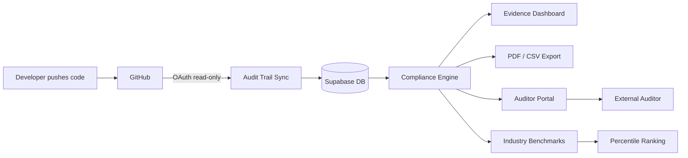

1. **Connect**: Sign in with GitHub and select the repositories you want to track.
2. **Sync**: Audit Trail pulls commits, pull requests, code reviews, and branch protection settings via the GitHub API (read-only; we never access your source code).
3. **Map**: The compliance engine scores each of the 63 controls across 8 frameworks based on your real activity.
4. **Monitor**: Alerts fire when your posture changes: score drops, control regressions, branch protection weakened, PRs merged without review.
5. **Report**: View a live dashboard, invite auditors to a token-gated workspace, generate PDF/CSV reports, or share a public read-only link.
6. **Benchmark**: See how your score compares to similar companies (same industry, same size) using anonymised aggregate data.

---

## Business Model

Audit Trail is a freemium SaaS that removes the manual labour of compliance evidence collection. Engineers stop taking screenshots and maintaining spreadsheets; the product does it automatically from the Git activity they're already producing.

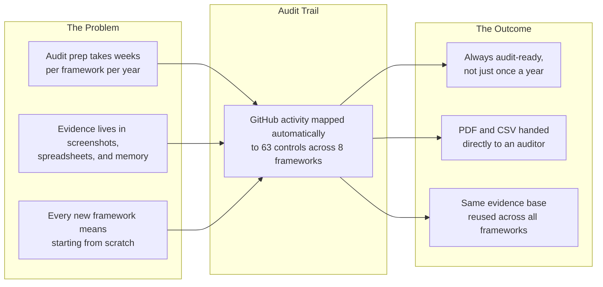

### Freemium Tiers

|                                           | Free    | Pro       |
| ----------------------------------------- | ------- | --------- |
| Repositories                              | Up to 2 | Unlimited |
| Compliance frameworks                     | 3 of 8  | All 8     |
| Live evidence dashboard                   | Yes     | Yes       |
| Gap analysis with action steps            | Yes     | Yes       |
| Basic compliance alerts                   | Yes     | Yes       |
| Control notes & exceptions                | Yes     | Yes       |
| PDF / CSV exports                         | No      | Yes       |
| Shareable auditor links                   | No      | Yes       |
| Auditor portal (comments, sign-offs, ZIP) | No      | Yes       |
| Industry benchmark comparisons            | Limited | Full      |
| Advanced alerts & full alert history      | No      | Yes       |
| Weekly email digest                       | Yes     | Yes       |
| API key access                            | Yes     | Yes       |
| Priority support                          | No      | Yes       |

### Revenue Flow

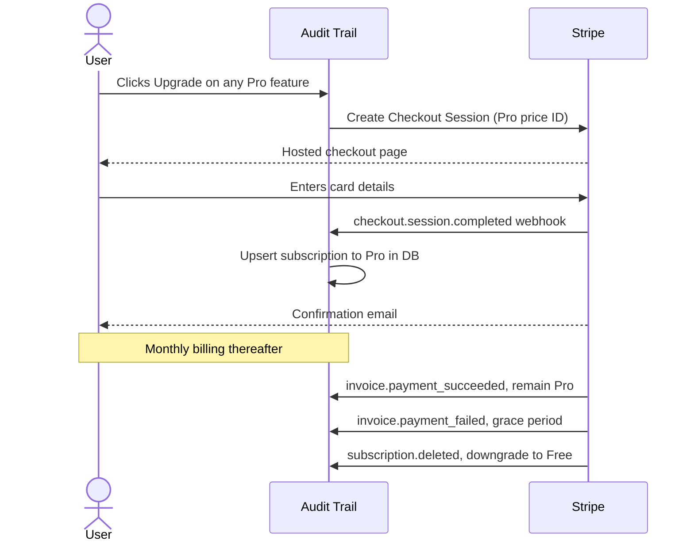

---

## Growth & Defensibility

Audit Trail is built around four compounding growth mechanics that make the product harder to leave and more valuable as the user base grows.

### 1. Proprietary Data Flywheel

Every organisation that uses Audit Trail contributes anonymised, aggregated compliance signals to a proprietary benchmark dataset. No individual org's data is ever exposed; cohorts require a minimum of 5 organisations before any benchmark is published. But as more companies join, the dataset becomes uniquely valuable:

- **Percentile rankings**: "Your SOC 2 score is in the 73rd percentile for 11–50 person SaaS companies."
- **Control-level pass rates**: "62% of similar companies have evidence for CC6.1."
- **Segment filters**: industry (SaaS, fintech, healthcare, government) × team size (1-10 through 1000+)

This dataset only exists inside Audit Trail. It cannot be replicated by a competitor starting from scratch.

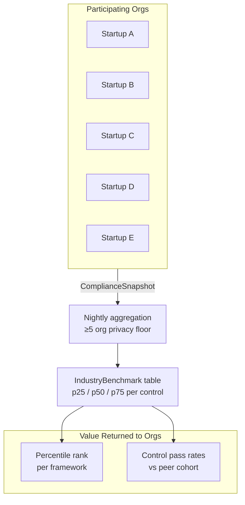

### 2. Workflow Lock-In

Two features accumulate value over time and make migration painful:

**Control Notes:** Team-authored narrative explanations for how your organisation satisfies each control (e.g. "We use protected branches + required reviews instead of a separate code-signing process"). These build up over months and represent institutional compliance knowledge that lives exclusively in Audit Trail.

**Evidence Exceptions:** Controls marked as "not applicable to us" with a reason and optional expiry date. An organisation that has exception-annotated dozens of controls would need to recreate that entire context from scratch in any competing tool.

### 3. Continuous Compliance Monitoring

Audit Trail doesn't just show you where you stand; it alerts you the moment your posture degrades:

| Alert Type                 | Trigger                                                 | Default Severity       |
| -------------------------- | ------------------------------------------------------- | ---------------------- |
| Score drop                 | Overall or per-framework score falls >5pts              | Medium (>10pts = High) |
| Control regression         | A previously evidenced control loses evidence           | High                   |
| Branch protection weakened | `requirePullRequest` flipped off on any repo            | Critical               |
| PR without review          | PRs merged to default branch without an APPROVED review | High                   |

Alerts deduplicate over 24h windows and email org owners/admins via Resend.

### 4. Auditor Portal

External auditors get a time-limited, token-gated workspace at `/auditor/{token}`. No account creation required. From there they can:

- **Browse** the full evidence dataset (filtered by framework if specified)
- **Comment** on individual controls to request additional evidence
- **Sign off** with a verdict: Approved / Needs More Info / Rejected
- **Download** a ZIP evidence package (README + summary.csv + evidence.csv)

Org teams manage auditor sessions from Settings → Auditor Access. Once an auditor has left comments and verdicts across an audit, that history becomes part of the org's compliance record, adding more migration cost.

---

## Features

| Feature                                   | Free | Pro |
| ----------------------------------------- | ---- | --- |
| Up to 2 repositories                      | Yes  |     |
| Unlimited repositories                    | No   | Yes |
| 3 compliance frameworks                   | Yes  |     |
| All 8 compliance frameworks               | No   | Yes |
| Live evidence dashboard                   | Yes  | Yes |
| Gap analysis with action steps            | Yes  | Yes |
| Prioritised gap remediation               | Yes  | Yes |
| Basic compliance alerts                   | Yes  | Yes |
| Advanced alerts & full alert history      | No   | Yes |
| Control notes & exceptions                | Yes  | Yes |
| Limited industry benchmarks               | Yes  |     |
| Full industry benchmarks (per-control)    | No   | Yes |
| PDF exports                               | No   | Yes |
| CSV exports                               | No   | Yes |
| Shareable read-only report links          | No   | Yes |
| Auditor portal (comments, sign-offs, ZIP) | No   | Yes |
| Email notifications                       | Yes  | Yes |
| API key access                            | Yes  | Yes |
| Priority support                          | No   | Yes |

### Key Highlights

- **Zero source-code access**: only metadata is read (commit messages, PR titles, review states, branch rules). Your actual code is never transmitted or stored.
- **Auto-sync via cron**: repositories sync on a daily schedule; manual sync is one click.
- **Gap analysis**: every control with missing or partial evidence shows a numbered action list explaining exactly what your team needs to do in GitHub to generate evidence. Gap controls are sortable by score impact ("Fix This First").
- **Continuous monitoring**: post-sync alert detection catches regressions before your next audit.
- **Auditor portal**: token-gated, no account required. Auditors view evidence, comment, sign off controls, and download a ZIP package.
- **Industry benchmarks**: proprietary percentile data built from anonymised usage; your compliance score ranked against companies with a similar profile.
- **Shareable reports**: generate a tokenised public URL (no login required) to share a read-only compliance snapshot with stakeholders.
- **Email notifications**: weekly compliance digest emailed via Resend; notification preferences configurable per organisation.

---

## Architecture

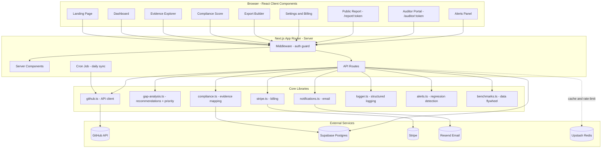

---

## Data Flow

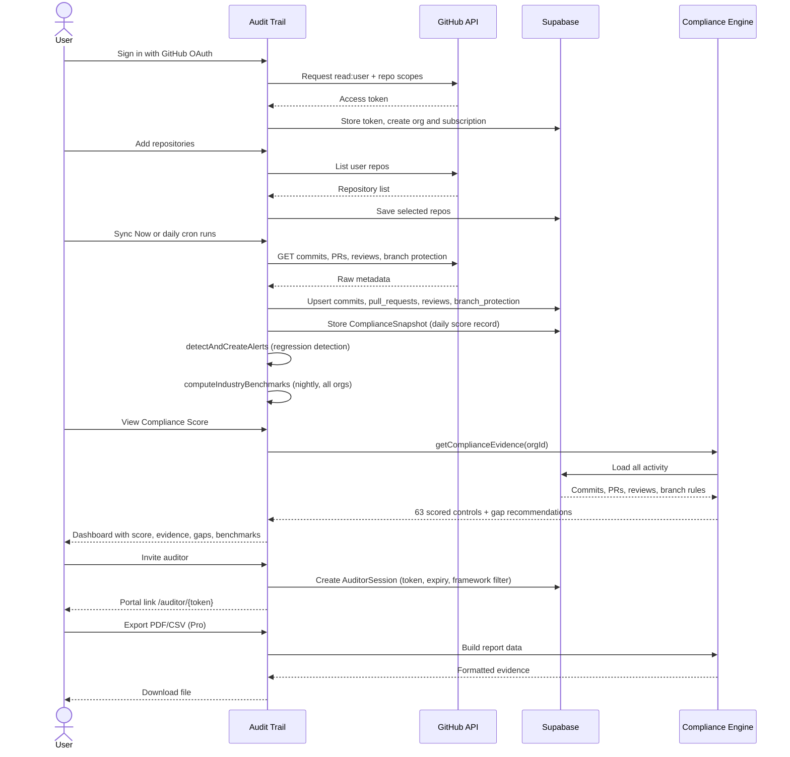

---

## Authentication Flow

Authentication uses **GitHub OAuth via NextAuth.js**. The app requests only read-only scopes (`read:user`, `repo` metadata). Source code is never accessed or stored.

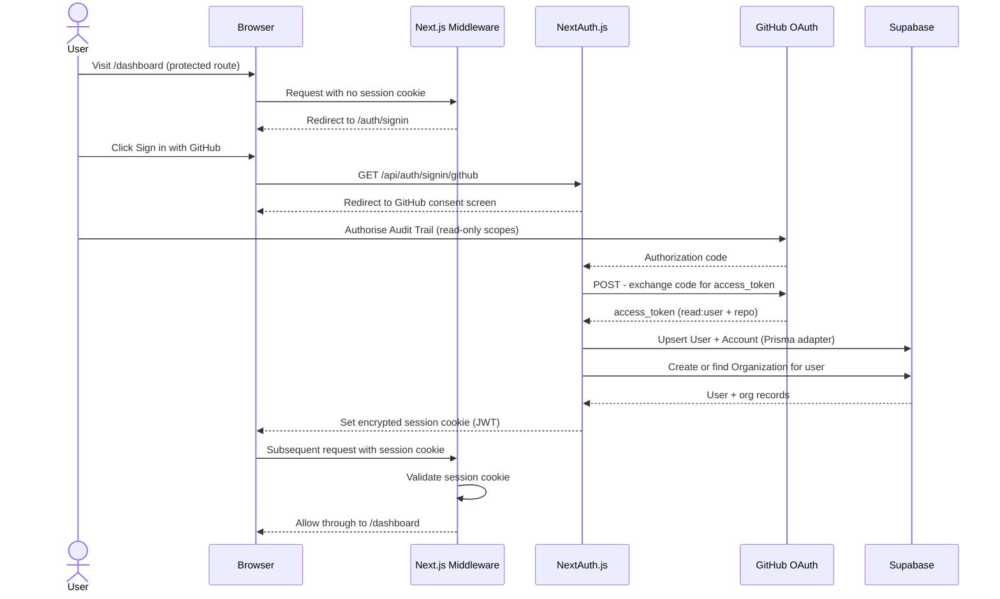

Session tokens contain `userId`, `orgId`, and `plan`. Enough context for every API route to authorise requests without an extra database round-trip.

The **Auditor Portal** (`/auditor/{token}`) is intentionally unauthenticated; it validates a 32-byte random token stored in `AuditorSession` and checks expiry on every request.

---

## Subscription Lifecycle

Billing is handled entirely by Stripe. The application reacts to Stripe webhook events to keep subscription state in sync.

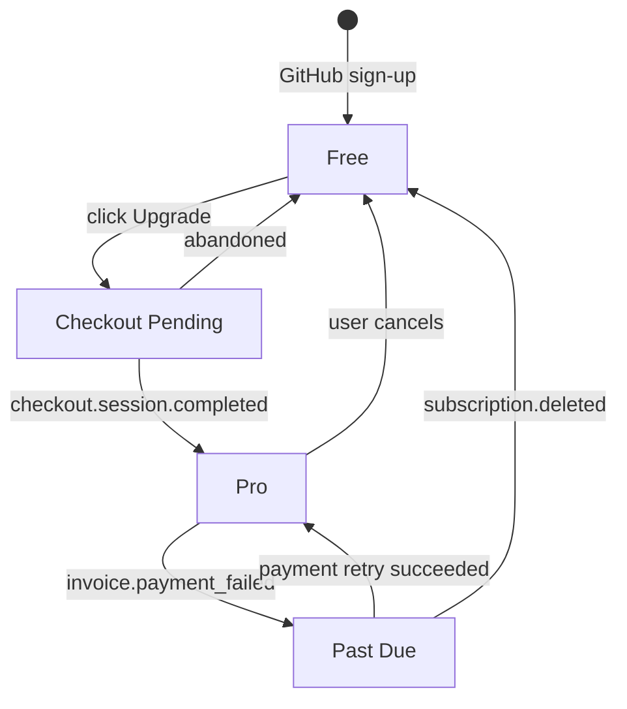

Stripe events handled by `/api/webhooks/stripe`:

| Event                           | Action                          |
| ------------------------------- | ------------------------------- |
| `checkout.session.completed`    | Activate Pro subscription in DB |
| `customer.subscription.updated` | Sync plan / status changes      |
| `customer.subscription.deleted` | Downgrade to Free               |
| `invoice.payment_failed`        | Mark subscription as `past_due` |

---

## Compliance Frameworks

Audit Trail supports **8 frameworks** covering **63 controls** in total.

| Framework                                                                                                              | Controls | Focus                                                     |
| ---------------------------------------------------------------------------------------------------------------------- | -------- | --------------------------------------------------------- |
| [ISO 27001:2022](https://www.iso.org/standard/27001)                                                                   | 19       | Information security management - Annex A.5 & A.8         |
| [Essential Eight](https://www.cyber.gov.au/resources-business-and-government/essential-cyber-security/essential-eight) | 6        | ACSC baseline strategies for Australian organisations     |
| [NIST CSF 2.0](https://www.nist.gov/cyberframework)                                                                    | 7        | US cybersecurity framework - Govern, Protect, Detect      |
| [NIST SP 800-53 Rev 5](https://csrc.nist.gov/publications/detail/sp/800-53/rev-5/final)                                | 7        | Federal controls - AC, CA, CM, SA, SI families            |
| [SOC 2](https://www.aicpa-cima.com/resources/landing/system-and-organization-controls-soc-suite-of-services)           | 5        | Trust Services Criteria - CC6, CC7, CC8                   |
| [GDPR](https://gdpr.eu/)                                                                                               | 9        | EU data protection - Art. 25 (privacy by design), Art. 32 |
| [SOCI Act](https://www.homeaffairs.gov.au/cyber-security-subsite/files/security-of-critical-infrastructure-act.pdf)    | 4        | AU critical infrastructure protection - PSO 1-4           |
| [PCI DSS 4.0](https://www.pcisecuritystandards.org/)                                                                   | 6        | Payment card industry - Requirements 6, 7, 8              |

### Control Coverage Map

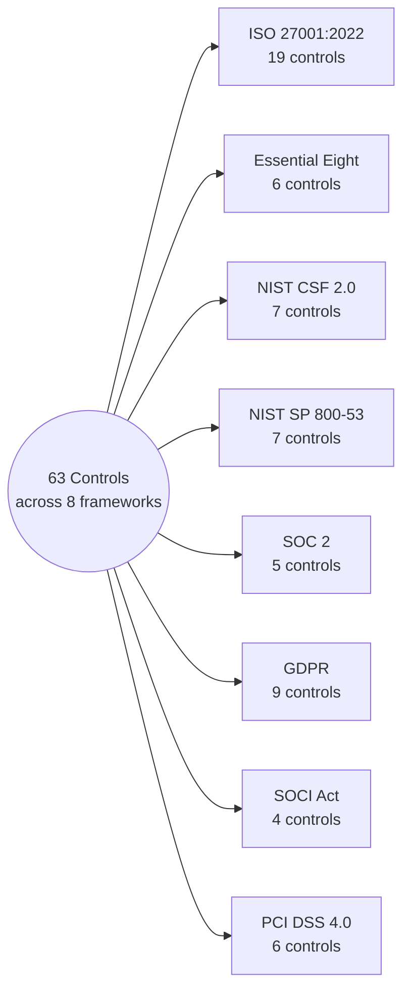

---

## Evidence Mapping

The compliance engine maps four types of GitHub artifacts to control requirements:

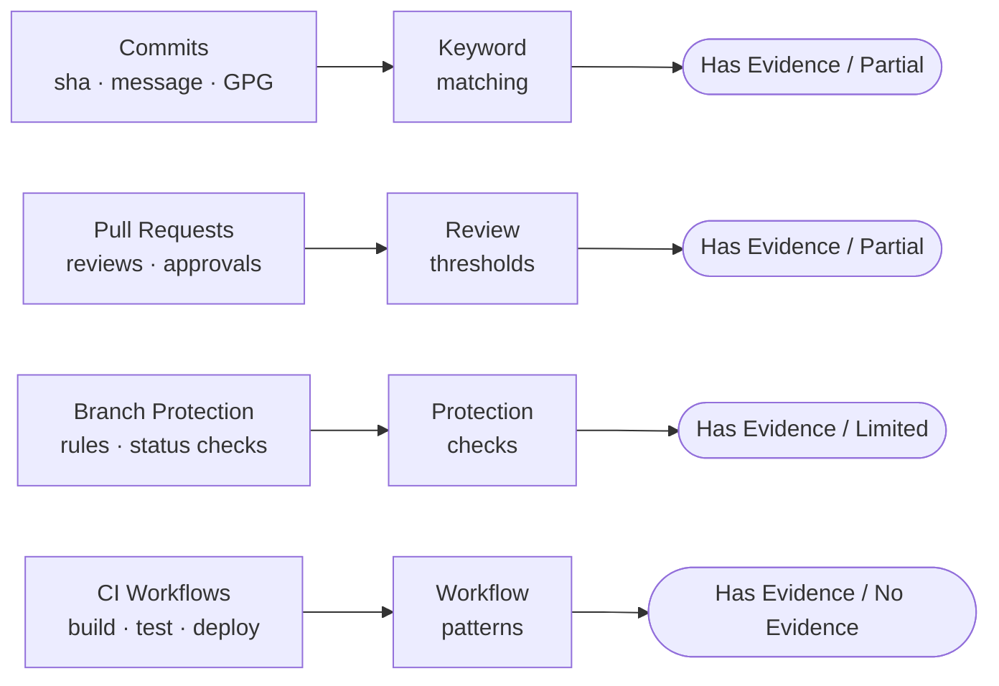

### Gap Analysis

When a control has `partial`, `limited`, or `no_evidence` status, Audit Trail surfaces a tailored recommendation panel inside the Evidence Explorer. Each recommendation includes:

- A **summary** of what the control requires
- A numbered **action list** of concrete steps to take in GitHub
- The specific commit keywords, PR patterns, or branch settings that will generate evidence
- A **score impact chip** showing how many points fixing this control would add to the overall score
- An **effort estimate** (Quick win / medium / Complex) based on evidence type

Controls can be sorted by "Fix This First" to prioritise the highest-impact gaps.

---

## Compliance Scoring

Each of the 63 controls is evaluated against the GitHub artifacts collected during a sync. The compliance engine (`lib/compliance.ts`) runs entirely server-side and never touches source code. Only commit messages, PR metadata, branch protection settings, and workflow names.

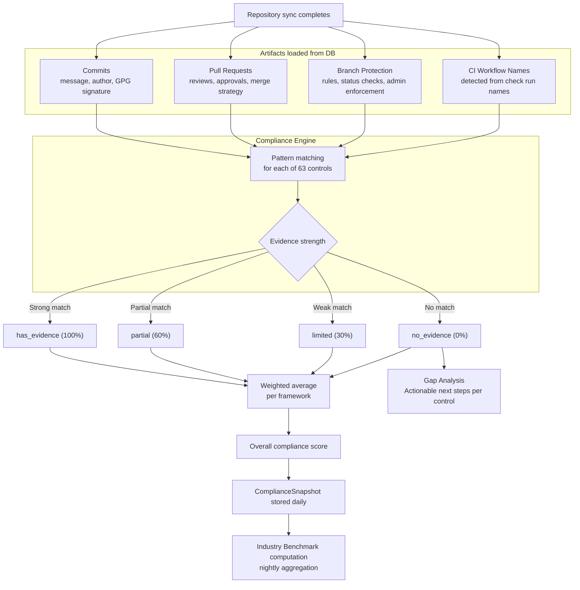

Framework scores are periodically snapshotted into the `ComplianceSnapshot` table, enabling the trend chart on the dashboard to show score changes over time, and feeding the nightly benchmark computation.

---

## Continuous Monitoring

After each sync the cron job runs `detectAndCreateAlerts()` to compare the new snapshot against the previous one.

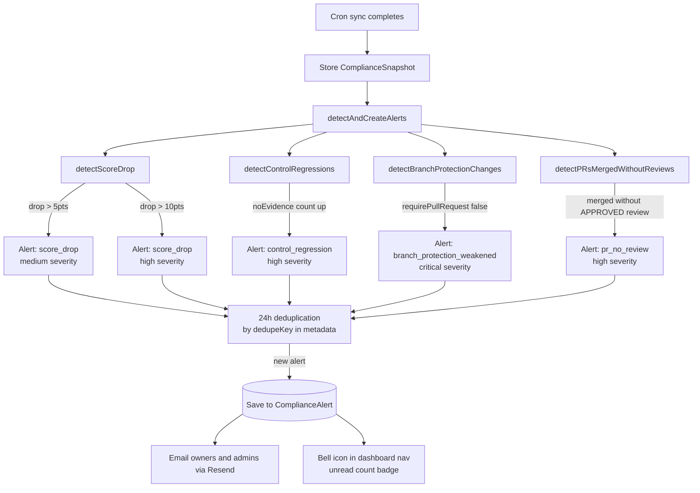

Org members can mark alerts as read or resolve them from the **Alerts Panel** (bell icon in the top navigation).

---

## Auditor Portal

The auditor portal is a separate, public-facing workspace at `/auditor/{token}`. It requires no account; only the 32-byte token issued when an org creates an auditor session.

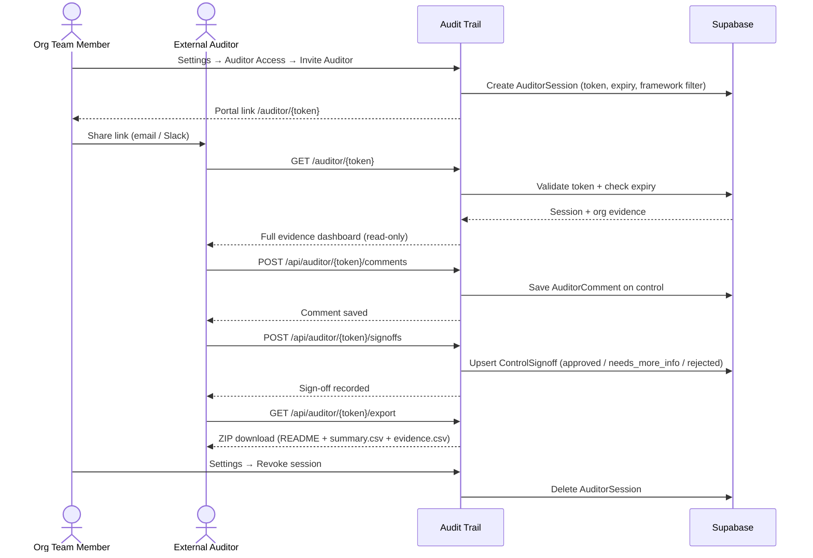

Org teams can revoke access at any time from Settings → Auditor Access. Active and signed-off verdicts appear as badges on control cards in the main evidence view.

---

## Database Schema

```mermaid
erDiagram
    Organization ||--o{ OrgMembership : has
    Organization ||--o| GitHubConnection : has
    Organization ||--o{ Repository : owns
    Organization ||--o| Subscription : has
    Organization ||--o{ Export : generates
    Organization ||--o{ ComplianceSnapshot : tracks
    Organization ||--o{ ShareableReport : creates
    Organization ||--o| NotificationPreferences : configures
    Organization ||--o{ ComplianceAlert : receives
    Organization ||--o{ ControlNote : has
    Organization ||--o{ EvidenceException : has
    Organization ||--o{ AuditorSession : manages
    Organization ||--o| OrgProfile : profiles

    User ||--o{ OrgMembership : "belongs to"
    User ||--o{ ApiKey : owns
    User ||--o{ ControlNote : authors

    Repository ||--o{ Commit : contains
    Repository ||--o{ PullRequest : contains
    Repository ||--o{ BranchProtection : has

    PullRequest ||--o{ Review : receives

    ComplianceFramework ||--o{ ComplianceControl : defines

    AuditorSession ||--o{ AuditorComment : has
    AuditorSession ||--o{ ControlSignoff : has

    Organization {
        string id PK
        string name
        string slug UK
        datetime createdAt
    }
    Repository {
        string id PK
        string orgId FK
        string fullName
        boolean isActive
        datetime lastSyncedAt
    }
    Commit {
        string id PK
        string repoId FK
        string sha
        string message
        boolean verified
        datetime committedAt
    }
    PullRequest {
        string id PK
        string repoId FK
        int githubPrId
        string state
        datetime mergedAt
    }
    BranchProtection {
        string id PK
        string repoId FK
        boolean requirePullRequest
        int requiredApprovals
        boolean enforceAdmins
    }
    ShareableReport {
        string id PK
        string orgId FK
        string token UK
        string title
        datetime expiresAt
    }
    ComplianceSnapshot {
        string id PK
        string orgId FK
        date snapshotDate
        float overallScore
        json frameworkScores
    }
    ComplianceAlert {
        string id PK
        string orgId FK
        string type
        string severity
        string title
        string description
        json metadata
        datetime resolvedAt
        datetime readAt
        datetime createdAt
    }
    ControlNote {
        string id PK
        string orgId FK
        string controlCode
        string frameworkName
        string content
        string authorId FK
        datetime updatedAt
    }
    EvidenceException {
        string id PK
        string orgId FK
        string controlCode
        string frameworkName
        string reason
        datetime expiresAt
        string createdBy FK
    }
    AuditorSession {
        string id PK
        string orgId FK
        string auditorEmail
        string auditorName
        string token UK
        string frameworkFilter
        datetime expiresAt
        datetime lastActiveAt
    }
    AuditorComment {
        string id PK
        string orgId FK
        string sessionId FK
        string controlCode
        string frameworkName
        string body
        string status
    }
    ControlSignoff {
        string id PK
        string orgId FK
        string sessionId FK
        string controlCode
        string frameworkName
        string verdict
        string note
        datetime signedAt
    }
    OrgProfile {
        string id PK
        string orgId UK
        string industry
        string companySize
        string[] techStack
        datetime updatedAt
    }
    IndustryBenchmark {
        string id PK
        string framework
        string industry
        string companySize
        string controlCode
        float passRate
        float avgScore
        float p25
        float p50
        float p75
        int sampleCount
        datetime computedAt
    }
```

---

## API Surface

All API routes live under `/app/api/`. Dashboard routes require a valid NextAuth session. Auditor routes are token-gated. The public report endpoint and the Stripe webhook require no session.

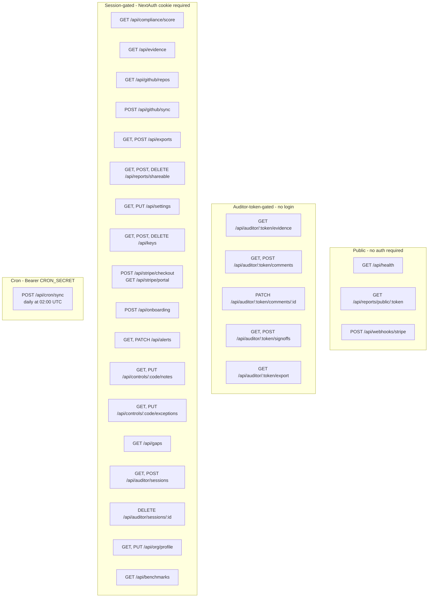

| Route                                | Method(s)         | Description                                               |
| ------------------------------------ | ----------------- | --------------------------------------------------------- |
| `/api/health`                        | GET               | Database + service health check                           |
| `/api/compliance/score`              | GET               | Overall + per-framework scores for the org                |
| `/api/evidence`                      | GET               | Full 63-control evidence dataset with gap recommendations |
| `/api/github/repos`                  | GET               | List connected repositories                               |
| `/api/github/sync`                   | POST              | Trigger manual repository sync                            |
| `/api/exports`                       | GET, POST         | List past exports / generate new PDF or CSV               |
| `/api/reports/shareable`             | GET, POST, DELETE | Manage shareable report tokens                            |
| `/api/reports/public/[token]`        | GET               | Public evidence summary (no auth required)                |
| `/api/settings`                      | GET, PUT          | Org info + notification preferences                       |
| `/api/keys`                          | GET, POST, DELETE | API key management (create, list, revoke)                 |
| `/api/stripe/checkout`               | POST              | Create Stripe Checkout session                            |
| `/api/stripe/portal`                 | GET               | Redirect to Stripe billing portal                         |
| `/api/webhooks/stripe`               | POST              | Stripe event handler (no auth, HMAC-verified)             |
| `/api/cron/sync`                     | POST              | Scheduled daily sync (bearer token auth)                  |
| `/api/onboarding`                    | POST              | Update onboarding step progress                           |
| `/api/alerts`                        | GET               | Unread count + recent alerts (filter by type/resolved)    |
| `/api/alerts/[id]`                   | PATCH             | Mark alert as read or resolve                             |
| `/api/controls/[code]/notes`         | GET, PUT, DELETE  | Team notes per control+framework                          |
| `/api/controls/[code]/exceptions`    | GET, PUT, DELETE  | Evidence exceptions with optional expiry                  |
| `/api/gaps`                          | GET               | Prioritised gap list sorted by score impact               |
| `/api/auditor/sessions`              | GET, POST         | List / create auditor sessions                            |
| `/api/auditor/sessions/[id]`         | DELETE            | Revoke an auditor session                                 |
| `/api/auditor/[token]/evidence`      | GET               | Token-gated evidence + sign-off metadata                  |
| `/api/auditor/[token]/comments`      | GET, POST         | List / add comments per control                           |
| `/api/auditor/[token]/comments/[id]` | PATCH             | Resolve a comment (org auth required)                     |
| `/api/auditor/[token]/signoffs`      | GET, POST         | List / upsert sign-off verdicts                           |
| `/api/auditor/[token]/export`        | GET               | Download ZIP evidence package                             |
| `/api/org/profile`                   | GET, PUT          | Industry + team size for benchmark segmentation           |
| `/api/benchmarks`                    | GET               | Percentile ranking vs. peer cohort per framework          |

---

## Tech Stack

| Layer         | Technology                                                                      | Notes                                      |
| ------------- | ------------------------------------------------------------------------------- | ------------------------------------------ |
| Framework     | [Next.js 14](https://nextjs.org/) App Router                                    | Server + client components, API routes     |
| Language      | TypeScript (strict)                                                             | Full type coverage                         |
| Database      | [PostgreSQL](https://www.postgresql.org/) via [Supabase](https://supabase.com/) | Free tier works for dev                    |
| ORM           | [Prisma](https://www.prisma.io/)                                                | Type-safe queries, schema-as-code          |
| Auth          | [NextAuth.js v5](https://authjs.dev/)                                           | GitHub OAuth, JWT sessions, Prisma adapter |
| Payments      | [Stripe](https://stripe.com/)                                                   | Subscriptions, billing portal, webhooks    |
| Email         | [Resend](https://resend.com/)                                                   | Weekly digest + compliance alert emails    |
| Styling       | [Tailwind CSS](https://tailwindcss.com/)                                        | Utility-first, custom accent colour        |
| Animations    | [Framer Motion](https://www.framer.com/motion/)                                 | Page transitions, micro-interactions       |
| Charts        | [Recharts](https://recharts.org/)                                               | Bar + pie charts for compliance scores     |
| PDF           | [@react-pdf/renderer](https://react-pdf.org/)                                   | Server-side PDF generation                 |
| ZIP           | [fflate](https://github.com/101arrowz/fflate)                                   | Evidence package export for auditor portal |
| Caching       | [Upstash Redis](https://upstash.com/)                                           | Optional; falls back gracefully if unset   |
| Rate Limiting | Upstash Ratelimit                                                               | Optional; sliding window per endpoint type |
| Hosting       | [Vercel](https://vercel.com/)                                                   | Zero-config, cron jobs, edge middleware    |
| Analytics     | [Vercel Analytics](https://vercel.com/analytics)                                | Privacy-friendly, no cookie banner needed  |

---

## Project Structure

```
audittrail-dev/
├── app/
│   ├── (dashboard)/            # Protected app pages (auth-gated by middleware)
│   │   ├── dashboard/          # Overview: stats, last sync, compliance trend
│   │   ├── repositories/       # Connect and manage GitHub repositories
│   │   ├── evidence/           # Per-control evidence explorer with gap analysis,
│   │   │                       #   team notes, exceptions, priority sort
│   │   ├── compliance/         # Score charts, framework breakdown, benchmark panel
│   │   ├── exports/            # PDF / CSV generation (Pro plan)
│   │   ├── settings/           # Billing, notifications, API keys,
│   │   │                       #   company profile, auditor access
│   │   └── onboarding/         # First-run setup wizard with auto-redirect
│   ├── api/
│   │   ├── auth/               # NextAuth.js handlers ([...nextauth])
│   │   ├── compliance/score/   # Overall + per-framework score
│   │   ├── evidence/           # Full evidence data (controls + items)
│   │   ├── exports/            # PDF/CSV generation endpoint
│   │   ├── github/             # Repository list + manual sync trigger
│   │   ├── reports/
│   │   │   ├── shareable/      # CRUD for shareable report tokens
│   │   │   └── public/[token]/ # Public evidence summary (no auth)
│   │   ├── alerts/             # GET alerts + PATCH [id] (read / resolve)
│   │   ├── controls/[code]/
│   │   │   ├── notes/          # Team notes per control
│   │   │   └── exceptions/     # Evidence exceptions per control
│   │   ├── gaps/               # Prioritised remediation roadmap
│   │   ├── auditor/
│   │   │   ├── sessions/       # Create / list / revoke auditor sessions
│   │   │   └── [token]/        # Token-gated: evidence, comments, sign-offs, export
│   │   ├── benchmarks/         # Percentile ranking vs. peer cohort
│   │   ├── org/profile/        # Industry + team size (benchmark segmentation)
│   │   ├── settings/           # Org info + notification preferences
│   │   ├── stripe/             # Checkout session + billing portal
│   │   ├── webhooks/stripe/    # Stripe event webhook handler
│   │   ├── keys/               # API key management (create, list, revoke)
│   │   ├── onboarding/         # Onboarding step tracking
│   │   ├── health/             # Health check endpoint
│   │   └── cron/sync/          # Scheduled daily auto-sync
│   ├── auth/                   # Sign-in, sign-out, error pages
│   ├── auditor/[token]/        # Public auditor portal (token-gated, no login)
│   ├── report/[token]/         # Public shareable report page (no auth required)
│   ├── changelog/              # Release history
│   ├── privacy/                # Privacy policy
│   ├── terms/                  # Terms of service
│   └── page.tsx                # Landing page (server component)
├── components/
│   ├── landing/                # Hero, Pricing, FAQ, SocialProof, etc.
│   ├── dashboard/              # DashboardNav, SyncButton, DashboardContent,
│   │                           #   AlertsPanel, AlertBell
│   ├── compliance/             # ShareReportButton, PublicReportControls
│   └── ui/                     # Design system: Card, Button, Badge, Input, etc.
├── lib/
│   ├── compliance.ts           # Core evidence-mapping engine (63 controls)
│   ├── gap-analysis.ts         # Per-control remediation recommendations + priority scoring
│   ├── alerts.ts               # Continuous monitoring: regression detection + alert creation
│   ├── benchmarks.ts           # Data flywheel: nightly aggregation + percentile computation
│   ├── github.ts               # GitHub REST API client
│   ├── github-sync.ts          # Repository sync orchestration
│   ├── auth.ts                 # NextAuth configuration + callbacks
│   ├── db.ts                   # Prisma singleton (serverless-safe)
│   ├── notifications.ts        # Resend email dispatch (weekly digest + alerts)
│   ├── stripe.ts               # Stripe checkout + portal helpers
│   ├── cache.ts                # Upstash Redis cache wrapper
│   ├── rate-limit.ts           # Upstash sliding-window rate limiter
│   ├── logger.ts               # Structured logging (wraps console.*)
│   ├── error-handler.ts        # AppError class + API error helper
│   ├── pdf.tsx                 # PDF report renderer
│   └── api/request.ts          # API request parsing helpers
├── prisma/
│   ├── schema.prisma           # Full database schema (16 models)
│   ├── migrations/             # SQL migration files
│   └── seed.ts                 # Framework + control seed data
├── types/
│   └── compliance.ts           # Shared TypeScript types (EvidenceStatus, etc.)
├── middleware.ts               # Auth routing guard (dashboard + API)
└── vercel.json                 # Cron schedule configuration
```

---

## Deployment

### Infrastructure Overview

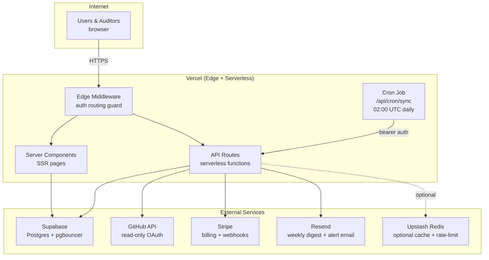

### Vercel

1. Fork this repo and push to your GitHub account.
2. Go to [vercel.com/new](https://vercel.com/new) and import the repository.
3. Set all environment variables (see `.env.example`) in the Vercel project settings.
4. Set the **Build Command** to `npx prisma generate && npm run build`.
5. Deploy. Vercel detects Next.js automatically.

### Cron Job

The `vercel.json` at the repo root schedules the daily sync:

```json
{
  "crons": [
    {
      "path": "/api/cron/sync",
      "schedule": "0 2 * * *"
    }
  ]
}
```

The cron job:

1. Syncs all active repositories across all organisations
2. Stores a daily `ComplianceSnapshot` per org
3. Runs `detectAndCreateAlerts()` to detect compliance regressions
4. Sends weekly digest emails on Mondays
5. Runs `computeIndustryBenchmarks()` once to refresh the benchmark dataset

The endpoint validates `Authorization: Bearer $CRON_SECRET`. Vercel Cron sends this automatically.

### Database Migration

Apply the migration SQL when your database is available:

```bash
# Development (direct connection)
npx prisma migrate dev

# Production (if running SQL manually)
psql $DATABASE_URL -f prisma/migrations/014_add_growth_features.sql
```

### Stripe Webhook

1. In [Stripe Dashboard → Webhooks](https://dashboard.stripe.com/webhooks), add endpoint:
   ```
   https://yourdomain.com/api/webhooks/stripe
   ```
2. Subscribe to events:
   - `checkout.session.completed`
   - `customer.subscription.updated`
   - `customer.subscription.deleted`
   - `invoice.payment_failed`
3. Copy the **Signing secret** into `STRIPE_WEBHOOK_SECRET`.

### GitHub OAuth App

1. Go to **GitHub → Settings → Developer settings → OAuth Apps → New OAuth App**.
2. Set **Homepage URL** to your production domain.
3. Set **Authorization callback URL** to:
   ```
   https://yourdomain.com/api/auth/callback/github
   ```
4. Copy the Client ID and Client Secret into your environment variables.

---

## License

Proprietary. All rights reserved (c) 2026 Audit Trail.
