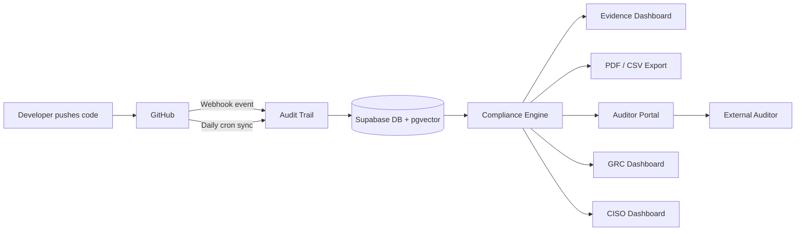

# Audit Trail

> Real-time compliance evidence from your GitHub activity. Automatically.

Audit Trail connects to your GitHub repositories via a GitHub App and maps commits, pull requests, code reviews, branch protection rules, Dependabot alerts, code scanning findings, secret scanning alerts, and deployment approvals to the controls inside 8 major compliance frameworks — in real time as events happen, not just at audit time.

---

## Table of Contents

- [How It Works](#how-it-works)
- [Features](#features)
- [Architecture](#architecture)
- [GitHub App & Webhooks](#github-app--webhooks)
- [Compliance Frameworks](#compliance-frameworks)
- [Evidence Mapping](#evidence-mapping)
- [Vector Embeddings](#vector-embeddings)
- [GRC Operations](#grc-operations)
- [Persona Dashboards](#persona-dashboards)
- [Data Portability](#data-portability)
- [Flywheel Instrumentation](#flywheel-instrumentation)
- [Scheduled Reports](#scheduled-reports)
- [Tech Stack](#tech-stack)
- [Database Schema](#database-schema)
- [API Surface](#api-surface)
- [Environment Variables](#environment-variables)
- [Local Development](#local-development)
- [Deployment](#deployment)
- [Testing](#testing)
- [Project Structure](#project-structure)

---

## How It Works



1. **Install GitHub App** — one click, read-only access. Webhooks activate immediately.
2. **Events stream in real time** — every push, PR, review, alert, and deployment is captured the moment it happens.
3. **Compliance engine maps evidence** — pattern matching + Gemini vector embeddings map each artifact to framework controls.
4. **Gaps are flagged instantly** — security alerts, unreviewed merges, and weakened branch protection trigger compliance alerts before your auditor sees them.
5. **Export when ready** — PDF reports and CSV tables with timestamped evidence, control mappings, and source references.

---

## Features

### Phase 1 — GitHub Signal Expansion

**Real-time webhooks** (`app/api/webhooks/github/route.ts`)

- GitHub App installation: users install once, webhooks activate across all repos
- HMAC-SHA256 signature verification with `timingSafeEqual` on every request
- Delivery ID deduplication — replayed webhooks are silently ignored
- Fire-and-forget dispatch with error logging; returns `{ received: true }` immediately
- Processes: `push`, `pull_request`, `pull_request_review`, `member`, `organization`, `workflow_run`, `dependabot_alert`, `code_scanning_alert`, `secret_scanning_alert`, `branch_protection_rule`, `branch_protection_configuration`, `repository_ruleset`, `security_and_analysis`, `deployment`, `deployment_review`, `deployment_status`, `deployment_protection_rule`, `release`, `fork`, `team`, `membership`, `deploy_key`, `workflow_dispatch`, `security_advisory`, `repository`, `public`, `meta`, `installation_target`

**Security alert handlers** (`lib/webhook-handlers.ts`)

- `handleDependabotAlertEvent` — critical/high CVEs → `ComplianceAlert`; maps to A.12.6.1, A.14.2.8, SOC2-CC7.1
- `handleCodeScanningAlertEvent` — SAST error-severity findings → `ComplianceAlert`; maps to A.14.2.1, CC7.1
- `handleSecretScanningAlertEvent` — always CRITICAL alert; maps to A.9.4.3, CC6.1

**Org membership events** — access management evidence for A.9.2.1, A.9.2.6, CC6.2, CC6.3

**CI artifacts** (`lib/ci-artifacts.ts`) — classifies workflow run artifacts (SARIF, SBOM, test reports, coverage) and upserts into `ci_artifacts` table

**Deployment environments** — syncs GitHub environment protection rules (required reviewers, prevent self-review) for change management evidence

### Phase 2 — Vector Embeddings (Supabase pgvector + Gemini Embedding 2)

**Embedding model**: `gemini-embedding-2-preview` at 768 dimensions via `@google/genai`

**Multimodal support** (`lib/embeddings.ts`)

- `embedText()` — commits, PRs, control descriptions
- `embedImage()` — architecture diagrams, MFA screenshots (PNG/JPEG)
- `embedPdf()` — policy documents, procedures (Gemini OCR, up to 6 pages)
- `embedAudio()` — security review meeting recordings (MP3/WAV, up to 80s)
- `embedMultipart()` — combined text + image → single aggregated vector

**Supabase vector store** — HNSW indexes on `evidence_embeddings` and `control_embeddings` tables; cosine similarity via Postgres RPC functions `match_evidence` and `match_controls`

**Confidence scoring** — blends pattern-match score (40%) with embedding cosine similarity (60%); tiers: `high` ≥0.85, `medium` ≥0.60, `low` <0.60

**Control embeddings** — all 63 control descriptions pre-seeded via `prisma/seed-embeddings.ts`

**Zero-shot framework mapping** — paste any custom framework; evidence corpus is searched via embeddings to show coverage with confidence scores

### Phase 3 — GRC Operational Layer

**Risk register** (`app/api/risk-treatments/`) — treatment types: `remediate | accept | transfer | avoid`; auto-closes when evidence appears after sync

**Gap ownership** (`app/api/gaps/[controlCode]/assign/`) — assign compliance gaps to team members with due dates

**Audit cycles** (`app/api/audit-cycles/`) — track engagement from planning → fieldwork → reporting → closed; findings, auditor requests, evidence snapshots

### Phase 4 — GRC + CISO Dashboards

**GRC dashboard** (`app/api/dashboards/grc/`) — framework scorecards with delta, gap ownership table, risk treatment summary; 5-minute cache

**CISO dashboard** (`app/api/dashboards/ciso/`) — 12-month posture trend, benchmark percentile, predicted audit outcome

**Executive summary** (`app/api/ciso/executive-summary/`) — AI-drafted board narrative via Claude API; 24-hour cache

### Phase 5 — Data Portability

**Full export** (`app/api/org/export/`) — JSON/CSV ZIP of all org data: evidence artifacts, snapshots, audit cycles + findings, risk treatments, control notes, gap assignments, auditor sign-offs; stored in Supabase storage, download link via Resend

### Phase 6 — Flywheel Instrumentation

Anonymized signal capture (`lib/flywheel.ts`) gated by `FLYWHEEL_ENABLED=true`:

- Auditor signoffs (control code, verdict, embedding similarity, industry/size)
- Audit outcomes (framework, finding counts, evidence state vector)
- GRC annotations (control note embeddings)
- PII stripped via `sanitizePayload()` — no `orgId`, `userId`, `email`, `name` ever stored

### Phase 7 — Scheduled Reports

**Weekly GRC digest** — Monday mornings: AI-drafted via Claude, score delta, new alerts, open gaps
**Monthly CISO summary** — 1st of month: posture trend, benchmark, critical risk delta
Opt-out via `NotificationPreferences.grcWeeklyDigest` and `cisoMonthlySummary`

---

## Architecture

```
Next.js 14 App Router
├── app/
│   ├── (dashboard)/          # Authenticated app routes
│   ├── api/
│   │   ├── webhooks/github/  # GitHub App webhook receiver
│   │   ├── github/           # GitHub sync + app-callback
│   │   ├── evidence/         # Evidence + uploads
│   │   ├── gaps/             # Gap analysis + assignments
│   │   ├── alerts/           # Compliance alerts
│   │   ├── audit-cycles/     # Audit cycle management
│   │   ├── risk-treatments/  # Risk register
│   │   ├── dashboards/       # GRC + CISO dashboards
│   │   ├── cron/sync/        # Daily sync + scheduled reports
│   │   └── ...
│   └── auditor/[token]/      # Token-gated auditor portal
├── lib/
│   ├── webhook-handlers.ts   # GitHub event handlers
│   ├── embeddings.ts         # Gemini multimodal embeddings
│   ├── compliance.ts         # Evidence mapping engine
│   ├── gap-analysis.ts       # Gap detection + recommendations
│   ├── alerts.ts             # Compliance alert detection
│   ├── github-sync.ts        # Repository sync logic
│   ├── flywheel.ts           # Anonymized signal capture
│   └── ...
└── prisma/
    ├── schema.prisma         # 41 models
    ├── seed.ts               # Framework + control seeds
    └── seed-embeddings.ts    # Control embedding generation
```

---

## GitHub App & Webhooks

### How users connect

1. User clicks **"Install GitHub App"** on the dashboard
2. GitHub redirects to `github.com/apps/audit-trail-app/installations/new`
3. User selects which repos to grant access to
4. GitHub redirects back to `/api/github/app-callback?installation_id=xxx`
5. We store `installation_id` on their `github_connections` row
6. Webhooks start flowing immediately for all selected repos

### Webhook security

Every incoming webhook is verified with HMAC-SHA256 before any processing:

```typescript
const expected = `sha256=${createHmac("sha256", secret).update(body).digest("hex")}`;
timingSafeEqual(Buffer.from(expected), Buffer.from(signature));
```

### Org resolution

The webhook handler resolves which org the event belongs to by checking (in order):

1. `repository.full_name` → match against `repositories` table
2. `organization.login` → match against `github_connections`
3. `installation.id` → match against `github_connections.installation_id`

If no org is found, we return `200 { received: true, processed: false }` to prevent GitHub retrying.

### Webhook events processed

| Event                   | Handler                          | Evidence                                        |
| ----------------------- | -------------------------------- | ----------------------------------------------- |
| `push`                  | `handlePushEvent`                | Commits → change management, secure development |
| `pull_request`          | `handlePullRequestEvent`         | PRs → change management, peer review            |
| `pull_request_review`   | `handlePullRequestReviewEvent`   | Reviews → code review evidence                  |
| `member`                | `handleMemberEvent`              | Repo collaborator changes → access control      |
| `organization`          | `handleOrganizationEvent`        | Org member changes → access control             |
| `workflow_run`          | `handleWorkflowRunEvent`         | CI runs → CI artifact processing                |
| `dependabot_alert`      | `handleDependabotAlertEvent`     | Critical/high CVEs → ComplianceAlert            |
| `code_scanning_alert`   | `handleCodeScanningAlertEvent`   | SAST findings → ComplianceAlert                 |
| `secret_scanning_alert` | `handleSecretScanningAlertEvent` | Credential exposure → CRITICAL alert            |

---

## Compliance Frameworks

| Framework            | Controls | Mapped evidence types                                |
| -------------------- | -------- | ---------------------------------------------------- |
| ISO 27001:2022       | 19       | Commits, PRs, reviews, branch protection, alerts     |
| Essential Eight      | 13       | Patching, MFA, application control, backups          |
| NIST CSF 2.0         | 7        | Configuration, software dev, monitoring              |
| NIST SP 800-53 Rev 5 | 7        | Account management, change control, flaw remediation |
| SOC 2                | 5        | Access control, change management, monitoring        |
| GDPR                 | 3        | Privacy by design, security of processing, records   |
| SOCI Act             | 4        | Access control, system security (policy-based)       |
| PCI DSS 4.0          | 5        | Vulnerability management, web app security, access   |

---

## Evidence Mapping

Evidence is collected from four source types:

**Commits** — analysed by message pattern matching against 5 pattern families:

- `DEPENDENCY_PATTERNS` — dependency updates, CVE patches
- `INFRASTRUCTURE_PATTERNS` — Docker, Terraform, Kubernetes, CI configs
- `SECURITY_PATTERNS` — auth, encryption, XSS/SQLi/CSRF fixes
- `TEST_PATTERNS` — unit, integration, e2e test additions
- `CICD_SECURITY_PATTERNS` — Snyk, SonarQube, CodeQL, SAST/DAST tool references

**Pull requests** — state (merged/open/closed), review count, base branch, author

**Branch protection** — required reviews, CODEOWNERS enforcement, status checks, admin bypass

**Security alerts** — Dependabot CVE severity, code scanning rule severity, secret type

Scoring:

- `strong` (score 3): ≥10 evidence items
- `partial` (score 2): 1–9 evidence items
- `limited` (score 1): exists but minimal
- `no_evidence` (score 0): nothing found

Overall score = sum of control scores / max possible score × 100

---

## Vector Embeddings

Control descriptions and evidence artifacts are embedded using Gemini Embedding 2 at 768 dimensions. Stored in Supabase with HNSW indexes for sub-10ms similarity search.

**Seeding controls:**

```bash
GEMINI_API_KEY=... NEXT_PUBLIC_SUPABASE_URL=... SUPABASE_SERVICE_ROLE_KEY=... \
  npx tsx prisma/seed-embeddings.ts
```

**Confidence tiers:**
| Tier | Cosine similarity | Meaning |
|---|---|---|
| `high` | ≥ 0.85 | Strong semantic match |
| `medium` | 0.60 – 0.84 | Probable match |
| `low` | < 0.60 | Weak signal only |

---

## Environment Variables

### Required

| Variable                | Purpose                                                      |
| ----------------------- | ------------------------------------------------------------ |
| `DATABASE_URL`          | PostgreSQL connection (Supabase, Transaction mode port 6543) |
| `DIRECT_URL`            | Direct PostgreSQL for migrations (port 5432)                 |
| `NEXTAUTH_URL`          | App base URL                                                 |
| `NEXTAUTH_SECRET`       | NextAuth session secret                                      |
| `GITHUB_CLIENT_ID`      | GitHub OAuth for user sign-in                                |
| `GITHUB_CLIENT_SECRET`  | GitHub OAuth secret                                          |
| `GITHUB_WEBHOOK_SECRET` | HMAC secret for webhook signature verification               |

### GitHub App

| Variable                   | Purpose                                      |
| -------------------------- | -------------------------------------------- |
| `GITHUB_APP_ID`            | Numeric App ID from github.com/settings/apps |
| `GITHUB_APP_CLIENT_ID`     | App Client ID                                |
| `GITHUB_APP_CLIENT_SECRET` | App Client Secret                            |
| `GITHUB_APP_PRIVATE_KEY`   | RSA private key (full PEM contents)          |

### Embeddings & AI

| Variable                    | Purpose                                      |
| --------------------------- | -------------------------------------------- |
| `GEMINI_API_KEY`            | Google Gemini Embedding 2 API key            |
| `NEXT_PUBLIC_SUPABASE_URL`  | Supabase project URL                         |
| `SUPABASE_SERVICE_ROLE_KEY` | Supabase service role key (server-side only) |
| `ANTHROPIC_API_KEY`         | Claude API for executive summaries           |

### Optional

| Variable                | Default | Purpose                          |
| ----------------------- | ------- | -------------------------------- |
| `FLYWHEEL_ENABLED`      | `false` | Enable anonymized signal capture |
| `STRIPE_SECRET_KEY`     | —       | Stripe billing                   |
| `STRIPE_WEBHOOK_SECRET` | —       | Stripe webhook verification      |
| `RESEND_API_KEY`        | —       | Email notifications and reports  |

---

## Local Development

```bash
# 1. Clone and install
git clone https://github.com/JohnJohnW/audittrail-dev
cd audittrail-dev
npm install

# 2. Configure environment
cp .env.example .env.local
# Fill in DATABASE_URL, NEXTAUTH_SECRET, GITHUB_CLIENT_ID/SECRET at minimum

# 3. Run migrations
npx prisma migrate dev

# 4. Seed compliance frameworks and controls
npx tsx prisma/seed.ts

# 5. Seed control embeddings (requires GEMINI_API_KEY)
npx tsx prisma/seed-embeddings.ts

# 6. Start dev server
npm run dev
```

### Webhook testing locally

Use [smee.io](https://smee.io) or [ngrok](https://ngrok.com) to forward GitHub webhooks to localhost:

```bash
npx smee -u https://smee.io/YOUR_CHANNEL -t http://localhost:3000/api/webhooks/github
```

---

## Deployment

Deployed on Vercel. Production database on Supabase.

**Important**: `DATABASE_URL` must use Supabase's Transaction mode (port 6543, `?pgbouncer=true`) to prevent connection pool exhaustion under concurrent requests. `DIRECT_URL` uses port 5432 for Prisma migrations.

**Cron jobs** — configured in `vercel.json`:

- `/api/cron/sync` — runs daily for sync + alerts + weekly/monthly reports

**Applying migrations to production**:

```sql
-- Run migration SQL directly in Supabase SQL editor
-- prisma/migrations/NNN_name/migration.sql
```

---

## Testing

```bash
npm run test          # Watch mode
npm run test:run      # Single run (CI)
npm run test:coverage # Coverage report (80% threshold)
```

Test files in `tests/lib/` and `tests/api/`. Mocking pattern:

```typescript
const mockDb = vi.hoisted(() => ({
  repository: { findFirst: vi.fn(), update: vi.fn() },
  commit: { upsert: vi.fn() },
}));

vi.mock("@/lib/db", () => ({ db: mockDb }));

beforeEach(() => vi.clearAllMocks());
```

---

## Project Structure

```
.
├── app/
│   ├── (dashboard)/              # Auth-required app pages
│   │   ├── dashboard/            # Main overview
│   │   ├── compliance/           # Framework compliance view
│   │   ├── evidence/             # Evidence explorer
│   │   ├── repositories/         # Repo management
│   │   ├── exports/              # Report exports
│   │   └── settings/             # Org settings
│   ├── api/                      # 54 API routes
│   ├── auditor/[token]/          # External auditor portal
│   └── page.tsx                  # Landing page
├── components/
│   ├── landing/                  # Marketing components
│   ├── dashboard/                # App UI components
│   └── ui/                       # Shared primitives
├── lib/
│   ├── webhook-handlers.ts       # GitHub event processing
│   ├── embeddings.ts             # Gemini multimodal embeddings
│   ├── compliance.ts             # Evidence mapping engine
│   ├── gap-analysis.ts           # Gap detection
│   ├── alerts.ts                 # Alert detection
│   ├── github-sync.ts            # Batch repo sync
│   ├── github.ts                 # GitHub API client
│   ├── flywheel.ts               # Signal capture
│   ├── ai-summary.ts             # Claude executive summaries
│   └── ...
├── prisma/
│   ├── schema.prisma             # 41 models
│   ├── seed.ts                   # Framework + control data
│   ├── seed-embeddings.ts        # Gemini embedding generation
│   └── migrations/               # SQL migrations
├── tests/
│   ├── lib/                      # Unit tests for lib modules
│   └── api/                      # API route tests
└── types/
    ├── webhook.ts                # GitHub webhook payload types
    └── ...
```

---

## License

MIT
