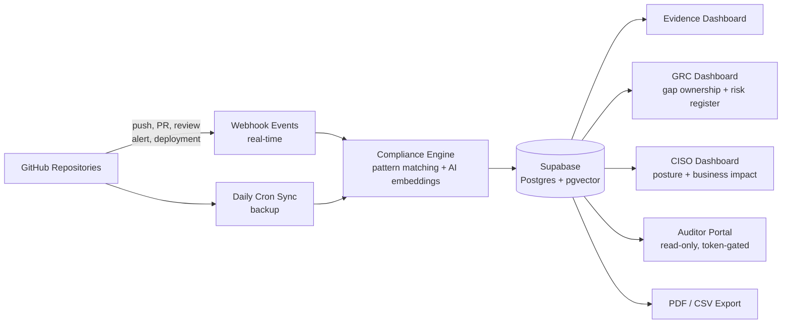
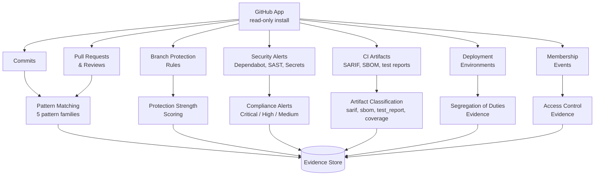
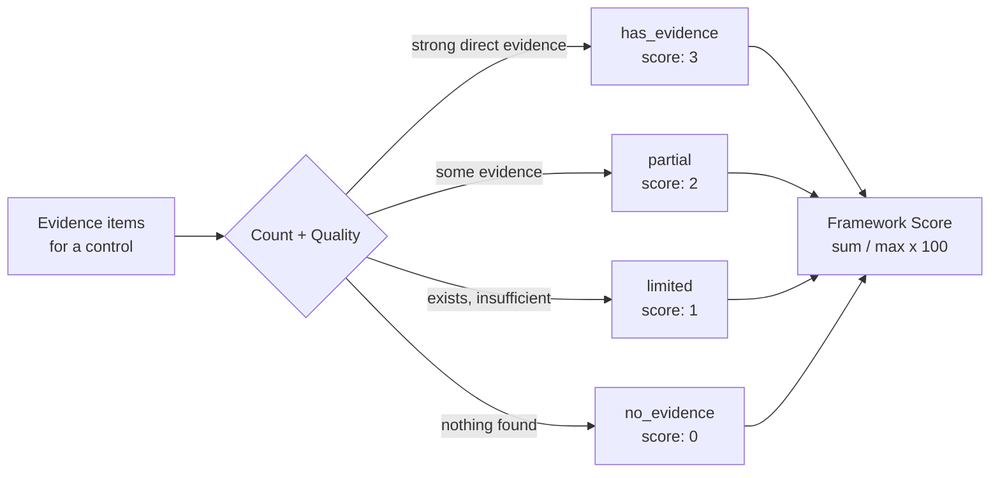
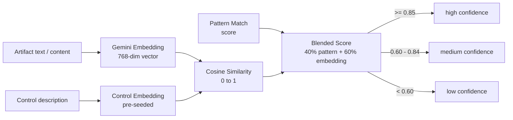
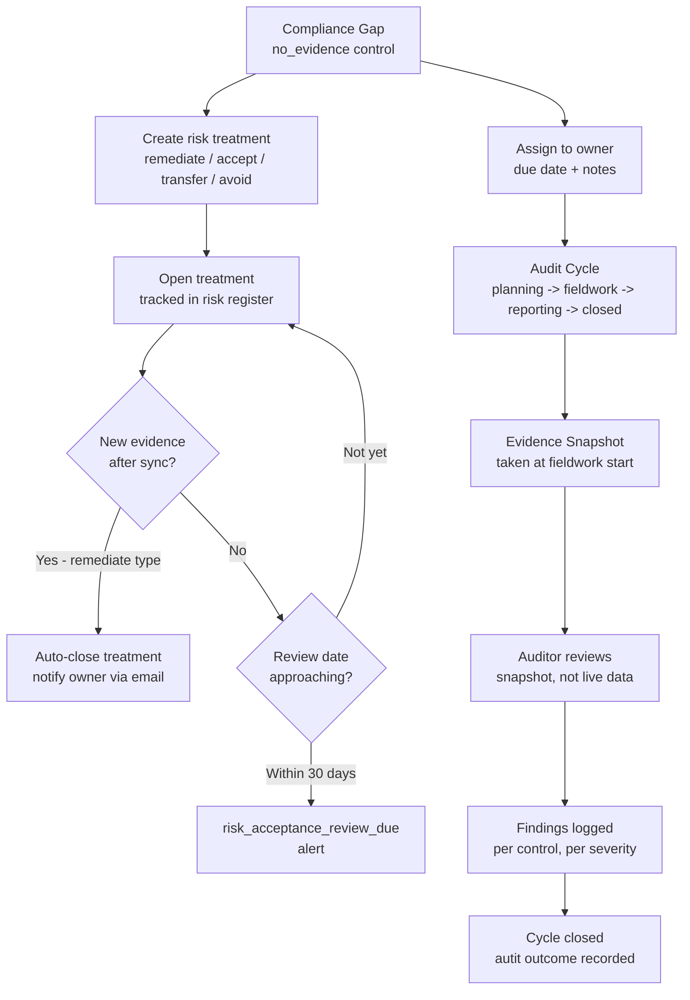
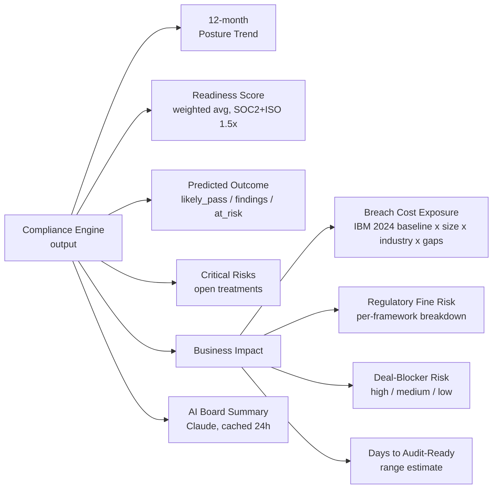
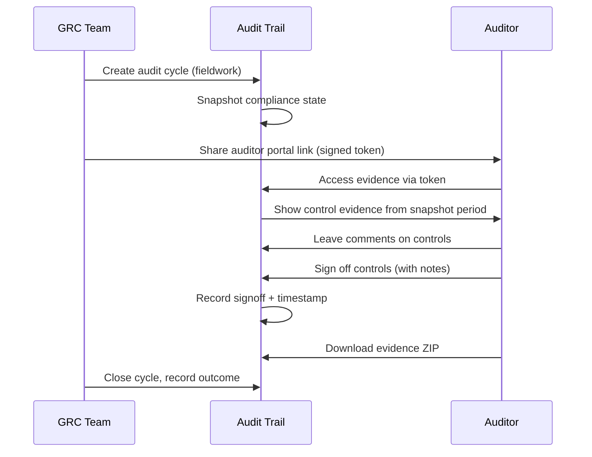
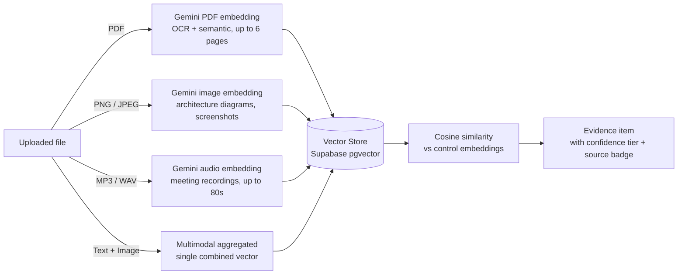
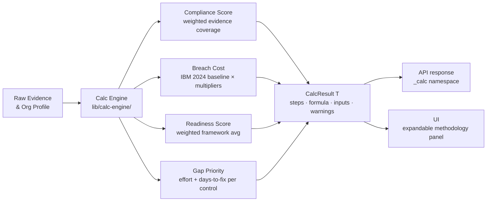
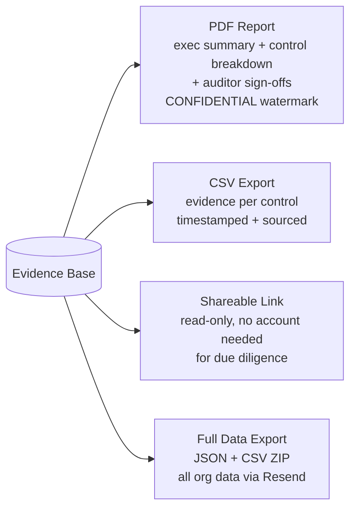

# Audit Trail

> Compliance that works in the background. Surfaces when it counts.

Compliance automation for SaaS teams that use GitHub. Connect your repositories once and Audit Trail maps every commit, pull request, code review, branch protection rule, and security alert to the controls inside six compliance frameworks — continuously, in real time, without any manual tagging. Built for SaaS startups (5-50 engineers) who need SOC 2 or ISO 27001 to close enterprise deals.

Assessment methodology based on NIST SP 800-53A Rev 5. Continuous monitoring approach follows NIST SP 800-137.

---

## How It Works



1. **Install the GitHub App** - one click, read-only. Webhooks activate across all selected repos immediately.
2. **Evidence streams in** - every push, PR, review, Dependabot alert, code scanning finding, secret exposure, and deployment approval is captured the moment it happens.
3. **The compliance engine maps it** - pattern matching combined with Gemini vector embeddings maps each artifact to specific controls. Evidence is scored, confidence-tiered, and stored.
4. **Gaps are flagged** - security alerts, unreviewed merges, and weakened branch protection trigger compliance alerts before your auditor sees them.
5. **Deliver anything, instantly** - audit packages, CISO board summaries, or partner due diligence reports are generated from the same live evidence base.

---

## Evidence Collection

Everything flows from GitHub. No agents to run, no code to instrument.



### What gets captured

| Source                      | What's extracted                                          | Controls evidenced                                     |
| --------------------------- | --------------------------------------------------------- | ------------------------------------------------------ |
| **Commits**                 | Message patterns, signing status, author, timestamp       | Change management, secure coding, MFA (signed commits) |
| **Pull requests**           | State, review count, base branch, merge timestamp         | Peer review, change management                         |
| **Code reviews**            | Reviewer, verdict, dismissal                              | Code review evidence                                   |
| **Branch protection**       | Required reviews, CODEOWNERS, status checks, admin bypass | Access control, change gating                          |
| **Dependabot alerts**       | CVE severity, package, fix status                         | Vulnerability management, patching                     |
| **Code scanning**           | Rule severity, tool (CodeQL, Semgrep), finding            | SAST evidence                                          |
| **Secret scanning**         | Secret type, exposure status                              | Credential management                                  |
| **CI artifacts**            | SARIF counts, SBOM contents, test pass/fail, coverage %   | Security testing, supply chain                         |
| **Deployment environments** | Required reviewers, prevent-self-review                   | Segregation of duties                                  |
| **Membership events**       | Member added/removed, role changes                        | Access review evidence                                 |

### Evidence scoring



### AI confidence scoring

Evidence mapping blends two signals into a single confidence score:



---

## Compliance Frameworks

Six frameworks with strong GitHub evidence coverage. Every account starts with a 14-day Pro trial; free plans include 2 frameworks, Pro ($5/mo) unlocks all six.

| Framework            | Controls | Key areas                                             |
| -------------------- | -------- | ----------------------------------------------------- |
| SOC 2                | 5        | Access control, change management, monitoring         |
| ISO 27001:2022       | 10       | Secure development, access control, change management |
| NIST CSF 2.0         | 7        | Configuration management, software dev, monitoring    |
| NIST SP 800-53 Rev 5 | 7        | Account management, change control, flaw remediation  |
| Essential Eight      | 5        | Patching, MFA, application control                    |
| PCI DSS 4.0          | 5        | Vulnerability management, web app security            |

We focus on frameworks where GitHub activity produces meaningful evidence. For frameworks that are primarily policy, organisational, or physical (GDPR, Zero Trust architecture, etc.), the controls can't be adequately evidenced from Git activity alone.

### What Audit Trail does NOT cover

Audit Trail covers SDLC controls evidenced by GitHub: change management, access control, vulnerability management, and security testing. It does not cover:

- **HR controls** — background checks, onboarding/offboarding, training records
- **Vendor/third-party risk** — supplier assessments, subprocessor management
- **Physical security** — facility access, environmental controls
- **Written policies** — acceptable use, incident response plans, business continuity
- **Network and infrastructure** — firewall rules, cloud IAM, encryption at rest

For these, Audit Trail clearly flags the gap and tells you what supplementary evidence is needed.

---

## GRC Operations

A full operational layer for GRC teams, running from the same evidence base as the compliance dashboard.



### Risk register

Track every gap with a treatment decision:

- **Remediate** - work is being done; auto-closes when evidence appears
- **Accept** - documented acceptance with review date; alerts when stale
- **Transfer** - risk transferred to third party
- **Avoid** - capability or feature removed

### Gap ownership

Assign gaps to named team members with due dates. Each assignee sees their open gaps via `/gaps/mine`. Email notifications on assignment.

### Audit cycles

Full lifecycle tracking from planning through to close. Moving a cycle to `fieldwork` freezes a compliance snapshot - auditors review that fixed state, not live data. Findings, auditor requests, and remediation commitments are tracked per control.

---

## CISO Dashboard

Executive-level view of security posture for board reporting, risk decisions, and deal due diligence.



Every business impact figure is powered by the Transparent Calculation Engine (see below) - the exact inputs, multipliers, and thresholds used are always visible. Nothing is a black box.

### Breach cost sources

The baseline is **AUD $4.26M** - the Australian-specific average from the IBM Cost of a Data Breach Report 2024 (Ponemon Institute methodology, published July 2024). This is the most methodologically rigorous figure available for Australia: it covers detection and escalation, notification, lost business, and post-breach response costs - not just criminal losses.

Cross-referenced against:

- **ASD Annual Cyber Threat Report 2024-25** (Australian Signals Directorate, October 2025): AUD $202,700 average self-reported loss per cybercrime report for large businesses; 84,700+ cybercrime reports in FY2024-25 (one every 6 minutes); critical infrastructure incident notifications up 111% year-on-year.
- **OAIC Notifiable Data Breaches Scheme**: 1,113 breaches notified in Australia across 2024 - the highest annual total since the NDB scheme began in 2018. 595 in H2 2024 alone.

Industry multipliers are derived from the IBM 2024 Australian cohort breakdown: technology sector averaged AUD $5.81M (x1.36 baseline), financial services AUD $5.61M (x1.32). Each unmitigated compliance gap adds 4% to the estimate - IBM AU 2024 found that organisations with AI and automation saved an average of AUD $1.74M per breach.

| Figure               | Basis                                                                                                                  |
| -------------------- | ---------------------------------------------------------------------------------------------------------------------- |
| Breach cost          | AUD $4.26M baseline (IBM Cost of a Data Breach 2024, AU cohort) x size x industry x gap severity                       |
| Government cross-ref | ASD Cyber Threat Report 2024-25 (Oct 2025): AUD $202,700 avg self-reported loss, large business                        |
| Regulatory fines     | GDPR Art. 83: 4% global turnover / PCI DSS: USD $100K/month max / SOCI Act: AUD $50M+ / Privacy Act 2024: AUD $50M max |
| Deal-blocker risk    | Readiness score and count of controls with no evidence against defined thresholds                                      |
| Days to audit-ready  | Readiness score bracket with empirical remediation time estimate per gap                                               |

---

## Auditor Portal

A read-only, token-gated portal for external auditors. No login or account required.



Auditor activity is logged with timestamps. Sign-offs include auditor name, date, and optional notes.

---

## Multimodal Evidence Uploads

Beyond Git activity, teams can upload direct compliance evidence - policy documents, architecture diagrams, training records - which are embedded and matched to controls via the same vector store.



Example use cases: security policy PDFs mapped to ISO 27001 A.5.1, MFA setup screenshots mapped to CC6.1, architecture diagrams mapped to NIST CSF network controls, security training completion records mapped to A.6.3.

---

## Transparent Calculation Engine

Every calculated value - compliance score, breach cost estimate, readiness score, gap effort - is wrapped in a `CalcResult<T>` that exposes the full audit trail of how the number was derived.



Every `CalcResult` includes:

| Field         | Description                                                                                     |
| ------------- | ----------------------------------------------------------------------------------------------- |
| `value`       | The calculated result                                                                           |
| `methodology` | Plain-language description of the approach                                                      |
| `formula`     | The exact formula used                                                                          |
| `steps`       | Step-by-step breakdown with source labels (`default` / `configured` / `automated` / `computed`) |
| `inputs`      | All raw inputs used                                                                             |
| `warnings`    | Any assumptions or missing data                                                                 |
| `isDefault`   | Whether org-specific overrides were applied                                                     |

### Per-org configuration

Every default value has a citation (IBM 2024, NIST methodology, etc.) and a recommendation string explaining when to override it. Admins can customise via `PUT /api/settings/calc-config`:

- `scoring.partialWeight` - how much partial evidence counts (default: 0.5)
- `scoring.frameworkWeights` - per-framework weighting (SOC 2 / ISO 27001 default: 1.5×)
- `businessImpact.breachBaseline` - replace the AUD $4.26M baseline with your own actuarial figure
- `businessImpact.gapEscalationRate` - adjust the 4%/gap rate
- `auditReadiness.dealBlocker` - customise high/medium risk thresholds
- `auditReadiness.predictedOutcome` - adjust pass/findings/at-risk gap counts
- `gapAnalysis.effortEstimates` - per-control effort and days-to-fix overrides

The `_calc` key is present on all relevant API responses (`/api/compliance/score`, `/api/dashboards/ciso`).

---

## Reports and Exports



All PDF exports include a diagonal `CONFIDENTIAL` watermark and the exporter's email address in the footer. Every export (PDF/CSV, full org ZIP, auditor ZIP) is written to the `Export` audit log with type, file name, status, and exporter identity.

Full data export includes: evidence artifacts, compliance snapshots, audit cycles and findings, risk treatments, control notes, gap assignments, auditor sign-offs. Excludes: benchmark percentiles, confidence model weights.

---

## Pricing

| Plan       | Price            | Limits                                                                     |
| ---------- | ---------------- | -------------------------------------------------------------------------- |
| Free       | $0/month         | 2 repos, 2 frameworks, no exports or auditor portal                        |
| Pro trial  | Free for 14 days | Full Pro access; 3 exports and 1 auditor session during trial              |
| Pro        | $5/month         | Unlimited repos, all 6 frameworks, exports, auditor portal, posture trends |
| Enterprise | Custom           | SSO, IRAP, HIPAA, dedicated support                                        |

No credit card required to start. The 14-day trial begins automatically on signup and converts to the free plan at expiry unless a subscription is started via Stripe.

---

## Getting Started

### Prerequisites

- Node.js 20+
- PostgreSQL (Supabase recommended)
- GitHub App (for webhook events)

### Local setup

```bash
# 1. Clone and install
git clone https://github.com/JohnJohnW/audittrail-dev
cd audittrail-dev
npm install

# 2. Configure environment
cp .env.example .env.local
# Required at minimum: DATABASE_URL, NEXTAUTH_SECRET, GITHUB_CLIENT_ID, GITHUB_CLIENT_SECRET

# 3. Run migrations
npx prisma migrate dev

# 4. Seed frameworks and controls (6 frameworks, 39 controls)
npx tsx prisma/seed.ts

# 5. Seed control embeddings (requires GEMINI_API_KEY)
npx tsx prisma/seed-embeddings.ts

# 6. Start dev server
npm run dev
```

### Webhook testing locally

```bash
npx smee -u https://smee.io/YOUR_CHANNEL -t http://localhost:3000/api/webhooks/github
```

---

## Environment Variables

### Required

| Variable                | Purpose                                           |
| ----------------------- | ------------------------------------------------- |
| `DATABASE_URL`          | PostgreSQL (Supabase Transaction mode, port 6543) |
| `DIRECT_URL`            | Direct PostgreSQL for migrations (port 5432)      |
| `NEXTAUTH_URL`          | App base URL                                      |
| `NEXTAUTH_SECRET`       | NextAuth session secret                           |
| `GITHUB_CLIENT_ID`      | GitHub OAuth for user sign-in                     |
| `GITHUB_CLIENT_SECRET`  | GitHub OAuth secret                               |
| `GITHUB_WEBHOOK_SECRET` | HMAC secret for webhook signature verification    |

### GitHub App

| Variable                   | Purpose                    |
| -------------------------- | -------------------------- |
| `GITHUB_APP_ID`            | Numeric App ID             |
| `GITHUB_APP_CLIENT_ID`     | App Client ID              |
| `GITHUB_APP_CLIENT_SECRET` | App Client Secret          |
| `GITHUB_APP_PRIVATE_KEY`   | RSA private key (full PEM) |

### AI and embeddings

| Variable                    | Purpose                                          |
| --------------------------- | ------------------------------------------------ |
| `GEMINI_API_KEY`            | Gemini Embedding 2 for vector embeddings         |
| `NEXT_PUBLIC_SUPABASE_URL`  | Supabase project URL                             |
| `SUPABASE_SERVICE_ROLE_KEY` | Supabase service role (server-side only)         |
| `ANTHROPIC_API_KEY`         | Claude for board summaries and scheduled reports |

### Optional

| Variable                                      | Purpose                                       |
| --------------------------------------------- | --------------------------------------------- |
| `STRIPE_SECRET_KEY` / `STRIPE_WEBHOOK_SECRET` | Billing                                       |
| `RESEND_API_KEY`                              | Email: alerts, reports, exports, contact form |
| `POSTHOG_KEY`                                 | Product analytics                             |
| `SENTRY_DSN`                                  | Error tracking                                |
| `FLYWHEEL_ENABLED`                            | Anonymized signal capture (default: false)    |

---

## Deployment

Deployed on Vercel with Supabase as the database.

`DATABASE_URL` must use Supabase Transaction mode (port 6543, `?pgbouncer=true`). `DIRECT_URL` uses port 5432 for migrations.

The daily cron job at `/api/cron/sync` handles: repository sync, alert detection, weekly GRC digest (Mondays), and monthly CISO summary (1st of month).

Migrations are applied by running the migration SQL directly in the Supabase SQL editor.

---

## Testing

```bash
npm run test:run      # Single run
npm run test:coverage # Coverage report (80% threshold)
```

Tests live in `tests/lib/` and `tests/api/`. All external dependencies (database, GitHub API, Gemini, Anthropic) are mocked via `vi.mock`.

---

## License

MIT
